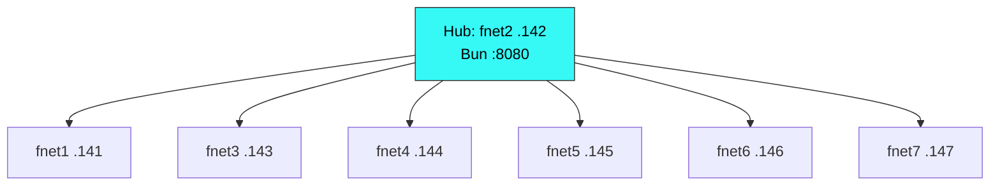

# Fleet Inventory

## [S-TIGHT]

Node inventory with IPs, roles, Ollama models, and pi versions for the 7-node fnet lab fleet.

[LOD: Low] *Always load. Core reference for node addressing and capabilities.*

## Topology

## Node Table

| Node | IP | Role | Ollama | pi | Agent |
|------|-----|------|--------|-----|-------|
| fnet2 | 192.168.0.142 | Hub host + worker | qwen3.5:4b, qwen3:8b, gemma4:e4b | 0.74.0 | ✅ |
| fnet1 | 192.168.0.141 | Worker | qwen3.5:4b, qwen3:8b, gemma4:e4b | 0.74.0 | ✅ |
| fnet3 | 192.168.0.143 | Worker | qwen3.5:4b, qwen3:8b, gemma4:e4b | 0.74.0 | ✅ |
| fnet4 | 192.168.0.144 | Worker | qwen3.5:4b, qwen3:8b, gemma4:e4b | 0.74.0 | ✅ |
| fnet5 | 192.168.0.145 | Worker | qwen3.5:4b, qwen3:8b, gemma4:e4b | 0.74.0 | ✅ |
| fnet6 | 192.168.0.146 | Worker | qwen3.5:4b, qwen3:8b, gemma4:e4b | 0.74.0 | ✅ |
| fnet7 | 192.168.0.147 | Worker | qwen3.5:4b, qwen3:8b, gemma4:e4b | 0.74.0 | ✅ |

## Quick Ref

- **Hub:** fnet2 (192.168.0.142:8080)
- **Workers:** fnet1, fnet3–fnet7 (5 typically online)
- **All nodes:** Same Ollama models, same pi version (0.74.0)

---

*See also: [CONNECTION.md](CONNECTION.md) for connect parameters, [MONITORING.md](MONITORING.md) for status checks.*