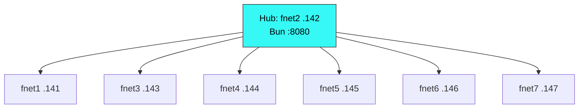

# Lab Fleet Deployment

Site-specific configuration for the fnet lab fleet. **This skill is deployment-specific** — do not install on other fleets.

## [S-TIGHT]

7-node lab fleet. Hub on fnet2 (192.168.0.142:8080). Auth token in env var or `-e` flag. 5 agents typically online (fnet3–7). Standup via `standup-fleet.yml`. Monitor via curl + SSH.

---

## Fleet Inventory



| Node | IP | Role | Ollama | pi | Agent |
|------|-----|------|--------|-----|-------|
| fnet2 | 192.168.0.142 | Hub host + worker | qwen3.5:4b, qwen3:8b, gemma4:e4b | 0.74.0 | ✅ |
| fnet1 | 192.168.0.141 | Worker | qwen3.5:4b, qwen3:8b, gemma4:e4b | 0.74.0 | ✅ |
| fnet3 | 192.168.0.143 | Worker | qwen3.5:4b, qwen3:8b, gemma4:e4b | 0.74.0 | ✅ |
| fnet4 | 192.168.0.144 | Worker | qwen3.5:4b, qwen3:8b, gemma4:e4b | 0.74.0 | ✅ |
| fnet5 | 192.168.0.145 | Worker | qwen3.5:4b, qwen3:8b, gemma4:e4b | 0.74.0 | ✅ |
| fnet6 | 192.168.0.146 | Worker | qwen3.5:4b, qwen3:8b, gemma4:e4b | 0.74.0 | ✅ |
| fnet7 | 192.168.0.147 | Worker | qwen3.5:4b, qwen3:8b, gemma4:e4b | 0.74.0 | ✅ |

---

## Connection Config

| Parameter | Value | Source |
|-----------|-------|--------|
| Hub URL | `http://192.168.0.142:8080` | Ansible inventory |
| Auth token | `$PI_COMS_NET_AUTH_TOKEN` | Env var or `-e coms_token=TOKEN` |
| Project name | `lab` | Fleet-wide default |
| Fallback token | `7e095b8e...386a0` | Used when env var unset in playbook |

### How to Connect

```bash
# From orchestrator pi session
pi -e src/index.ts \
  --name orchestrator \
  --project lab \
  --server-url http://192.168.0.142:8080 \
  --auth-token $PI_COMS_NET_AUTH_TOKEN
```

---

## Monitoring

### Fleet Status (one-liner)

```bash
export TOKEN="7e095b8e0b5d8bc44feea4da24e989fcf92b9341b5db8ed9604f05c412f386a0"

echo "=== HUB ==="
curl -sf http://192.168.0.142:8080/health | python3 -c "import json,sys; d=json.load(sys.stdin); print(f'Server: {d[\"server_id\"][:12]}...  Up since: {d[\"started_at\"][:19]}')"

echo "=== AGENTS ==="
curl -sf -H "Authorization: Bearer $TOKEN" "http://192.168.0.142:8080/v1/agents?project=lab" | python3 -c "
import json,sys
d=json.load(sys.stdin)
for a in d['agents']:
    print(f'  {a[\"name\"]:8} {a[\"status\"]:8} ctx:{a[\"context_used_pct\"]}% queue:{a[\"queue_depth\"]} model:{a[\"model\"]}')
print(f'  Total: {len(d[\"agents\"])} online')
"
```

### Per-Node SSH Check

```bash
for node in fnet1 fnet2 fnet3 fnet4 fnet5 fnet6 fnet7; do
  echo -n "  $node: "
  ssh -o ConnectTimeout=3 -o StrictHostKeyChecking=no "$node" "echo OK" 2>/dev/null || echo "DOWN"
done
```

### Key Files on Nodes

| File | Path | Purpose |
|------|------|---------|
| Agent log | `/tmp/pi-agent-{hostname}.log` | Agent output and errors |
| Agent PID | `/tmp/pi-agent-{hostname}.pid` | Process ID |
| Hub log | `/tmp/coms-net-hub.log` | Hub server output |
| Hub PID | `/tmp/coms-net-hub.pid` | Hub process ID |
| Extension code | `~/pi-cross-node-comms/` | Extension files |

---

## Playbook Triggers

| Trigger | Playbook | What It Does |
|---------|----------|-------------|
| `standup_fleet` / `stand up the fleet` | `standup-fleet.yml` | Full 6-phase standup |
| `--start-at-task "Kill any existing agent"` | Phase 5–6 | Re-launch agents |
| `--limit fnet3` | Any phase | Target single node |

```bash
# Full standup
./scripts/run-playbook.sh "stand up the fleet"

# Direct ansible
cd workshop/01-Projects/pi-cross-node-comms/ansible
ansible-playbook -i inventory.yml standup-fleet.yml

# Re-launch agents only
ansible-playbook -i inventory.yml standup-fleet.yml \
  --start-at-task "Kill any existing agent on this node"
```

---

## Troubleshooting This Deployment

| Symptom | Check | Fix |
|---------|-------|-----|
| Hub not responding | `curl http://192.168.0.142:8080/health` | Re-run Phase 1 |
| 0 agents online | `curl .../v1/agents?project=lab` | Re-run Phase 5 |
| Auth rejected | Verify `$TOKEN` env var | `export PI_COMS_NET_AUTH_TOKEN=TOKEN` |
| Node DOWN | `ssh fnet3 "echo OK"` | Physical check / network |
| Ollama missing models | `ssh fnet3 "ollama list"` | Re-run Phase 3 |
| Agent log has errors | `ssh fnet3 "tail -50 /tmp/pi-agent-fnet3.log"` | Check model / extension |
| Hub log has errors | `ssh fnet2 "tail -50 /tmp/coms-net-hub.log"` | Check Bun / token |

---

## See Also

- `pi-cross-node-comms` skill — coms-net tool surface (portable)
- `fleet-dispatcher-cascade` skill — three-tier cascade pattern (portable)
- Wiki: `fleet-operations/Monitoring & Management` — full API reference and dashboard