# AgenticOS: Comprehensive Implementation Guide

**Version:** 1.0.0  
**Date:** 2026-05-03  
**Author:** Trading Desk Technical Infrastructure  
**Source:** Synthesized from Simon Scrapes' "Creating Your Own Agentic OS is Easy (Insanely Powerful)"  
**Video Reference:** [YouTube: w0S-khYCaB4](https://www.youtube.com/watch?v=w0S-khYCaB4) · Duration: 24:34 · 759 segments  
**Status:** Design Phase — Ready for Implementation Planning

::: info Related Documents
- **📄 Full Transcript:** [agentic-os-transcript.md](./agentic-os-transcript.md) — Timestamped conversational transcript
- **📐 Raw Design Spec:** [../../designs/AgenticOS.md](../../designs/AgenticOS.md) — Complete architecture specification
- **🔗 TI-011 Meta-Orchestration:** [../operational/planning/PLAN-2026-05-01-1645.md](../operational/planning/PLAN-2026-05-01-1645.md)
- **💚 TI-023 Orchestrator Health:** [../operational/planning/PLAN-2026-05-03-1930-TI023-AUTO-DECOMPOSE-NODE-DISPATCH.md](../operational/planning/PLAN-2026-05-03-1930-TI023-AUTO-DECOMPOSE-NODE-DISPATCH.md)
:::

---

## Table of Contents

1. [Introduction: The Problem with Generic AI](#1-introduction-the-problem-with-generic-ai)
2. [What is an Agentic OS?](#2-what-is-an-agentic-os)
3. [The 9 Limitations of Out-of-the-Box LLMs](#3-the-9-limitations-of-out-of-the-box-llms)
4. [Static Context: Identity and Brand](#4-static-context-identity-and-brand)
5. [Memory Systems: Working vs. Long-Term](#5-memory-systems-working-vs-long-term)
6. [Architecture Overview: Clever Context Management](#6-architecture-overview-clever-context-management)
7. [Process Specialization: From Generalist to Specialist](#7-process-specialization-from-generalist-to-specialist)
8. [Autonomous Workflows: Multi-Step Execution](#8-autonomous-workflows-multi-step-execution)
9. [Client Separation: Clean Multi-Project Architecture](#9-client-separation-clean-multi-project-architecture)
10. [Predictable Outputs: File Structure and Organization](#10-predictable-outputs-file-structure-and-organization)
11. [Access from Anywhere: Remote Execution](#11-access-from-anywhere-remote-execution)
12. [Implementation Roadmap](#12-implementation-roadmap)
13. [Conclusion: Build Your Own AgenticOS](#13-conclusion-build-your-own-agenticos)

---


*Based on the AgenticOS framework by Simon Scrapes*

---

## 1. Introduction: The Problem with Generic AI

Simon Scrapes opens by describing the frustration many experience when using AI tools without an underlying system:

> **[00:03]** "It's forgetting context. You've got generic outputs and you're wasting time quite frankly."

The contrast is stark. Two people can use the exact same tool — the same model underneath — and yet produce completely different outcomes. One person struggles with repetitive, forgetful interactions while the other ships faster, gets better results, and actually saves time:

> **[00:09]** "They're shipping faster. They're getting better results and are actually saving time."
> **[00:17]** "The funny thing is they're both using the same tools, the same models underneath, but have completely different outcomes."

The core issue isn't the tool or the model — it's the lack of a system *underneath* the tool. As Scrapes explains, the difference comes down to something far more fundamental than prompting skill:

> **[00:23]** "It's not because they're better at prompting. It's because one group built something underneath the tool and the other group didn't. And that is an agentic operating system."

An **AgenticOS** is fundamentally a context-management infrastructure that transforms generic AI into a personalized, high-performing specialist. Without it, every session starts from zero. With it, the AI knows who you are, what you've done, and how you work.

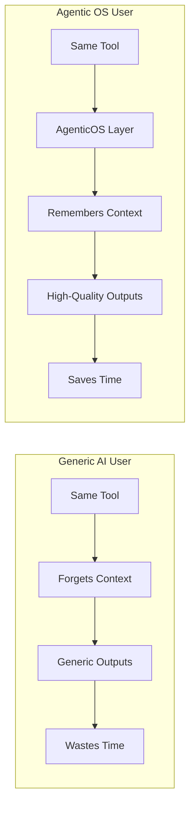

---

## 2. What is an Agentic OS?

An **Agentic Operating System** is a structured context layer that sits between you and the LLM. It is not code — it is organization. As Scrapes defines it:

> **[00:29]** "So it's a system that tells the AI who you are, what you've done, what matters to you, how you work, and how to execute on complex briefs."

With the right system in place, users can achieve **consistent high-quality outputs 90% of the time**. The goal is simple: whatever AI tool you're using, make it work the way you actually expect it to.

> **[00:38]** "And with the right system in place, you too can get these consistent high-quality outputs 90% of the time that you use it."
> **[00:50]** "So whatever AI tool you're using right now, it will actually work the way you expect it to."

The simplest way to understand an AgenticOS is to think of it as **clever context management** — a deliberate folder-and-file structure that tells your AI exactly what it needs to know, exactly when it needs to know it:

> **[02:51]** "And the simplest way to think about all of this is that an Agentic OS is just clever context management. So it's all about folders, files, and a structure that tells your AI tool exactly what it needs to know, exactly when it needs to know it."

Importantly, none of this requires coding expertise:

> **[03:04]** "And by the way, none of this is code. If you can organize a Notion workspace, then you can actually build out this for yourself, too."

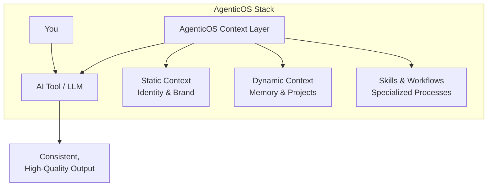

---

## 3. The 9 Limitations: What LLMs Can't Do Out of the Box

Every limitation of off-the-shelf LLMs is an opportunity for your AgenticOS to add value. Scrapes frames the entire system around overcoming **nine specific shortcomings**:

> **[00:58]** "So we effectively want to build with the AgenticOS something that overcomes the limitations of LLM out the box."

The nine limitations are:

1. **No identity or personal context** — The AI doesn't know who you are or how you work.
2. **No business or client context** — It lacks understanding of your projects, clients, and positioning.
3. **No memory across sessions** — It cannot recall what you worked on last week or last month.
4. **Generalist, not specialist** — Models are designed to be jacks of all trades, not masters of your processes.
5. **No autonomous multi-step execution** — It cannot run scheduled workflows without supervision.
6. **No adaptive planning depth** — It cannot scale planning granularity to match project complexity.
7. **No clean client separation** — Working across multiple clients risks context contamination.
8. **No predictable output structure** — Files and outputs end up scattered everywhere.
9. **No remote access** — The system is trapped on your local machine.

Scrapes emphasizes that each limitation maps directly to a section of the build process:

> **[02:22]** "So each one of these is actually a limitation of the LLMs and the tools we're using out of the box and each one is a section inside this video."
> **[02:29]** "So tick all of these nine off and you've got an agentic operating system that's going to produce you high-quality outputs on a consistent basis."

By the end of the build, these nine pieces assemble into a complete architecture diagram that serves as a portable blueprint.

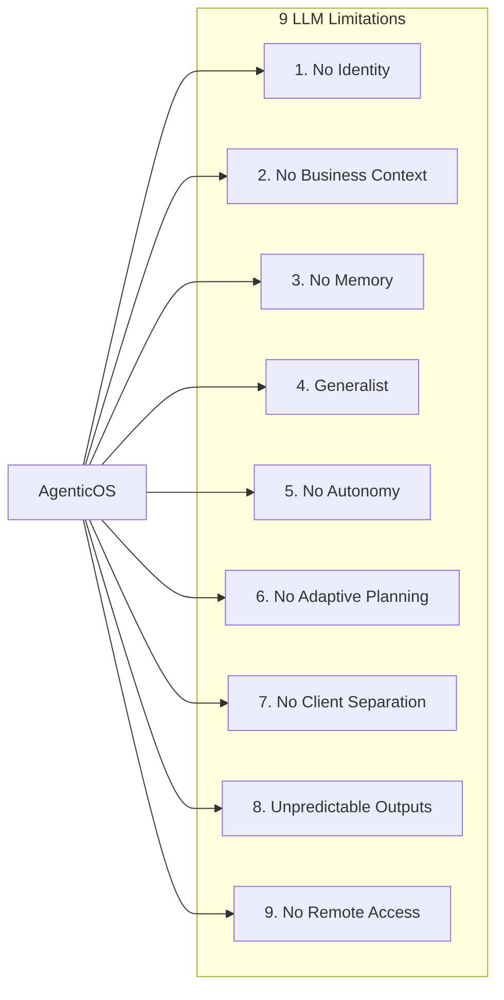

---

## 4. Static Context: Identity Files, User.md, Soul.md, and Brand Context

Out of the box, your AI tool starts every session from zero. You're forced to re-explain your role, your communication style, and your non-negotiables every single time. The fix is **static context** — files that rarely change but are injected at the start of every session.

> **[03:10]** "Out of the box, your AI tool is going to start every session from zero. and you're going to reexplain your role, your communication style, and all of those non-negotiables."
> **[03:20]** "So, we need to build a system that effectively tells the AI who you are, who it is, and how you work."

### Identity Files

Every agentic tool reads an **identity file** first — the name varies by platform:

> **[03:47]** "So in Claw Code you might be familiar with `claude.md`. In CodeEx and some others it's `agents.md`. In OpenClaw it's going to be the `soul.md` file but it's the same idea."

Think of this as content injected into the **system prompt** at the start of every session so the AI responds in a way relevant to you and your context.

Rather than writing these identity files from scratch, Scrapes recommends a far more effective approach: let the AI interview you.

> **[04:19]** "I'd highly recommend actually just letting AI interview you."
> **[04:36]** "Say something like, I'm building my identity file. Ask me 15 questions about how I work, what I want, what I don't want, how I want you to respond."

Once you answer those questions, the output goes into files like `user.md` (all about you) and `personality.md` or `soul.md` (all about the agent's persona). In Claude Code, the `claude.md` file then references these to inject context at the right time.

### Brand Context

The other half of static context is **brand context** — how your business speaks, your ideal customer profile, your market positioning, and other business assets.

> **[05:12]** "The other part of static context, and the reason we call it static is it's not going to change very often, is your brand context."
> **[05:37]** "This alone will 3x your output quality if you're producing any sort of knowledge work... it's going to 3x to 10x your output quality I guarantee it."

A well-designed AgenticOS doesn't ask you to write these from scratch — it runs interviews to extract your brand voice and automatically generates a 70% version within minutes.

### Static Context Folder Structure

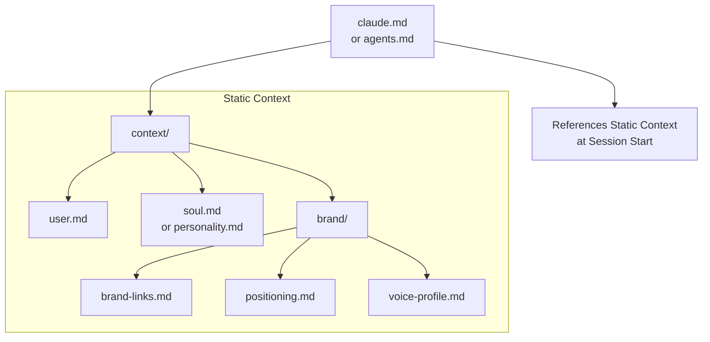

The shared brand context is critical because you update it in one place, and every skill pulls from it when needed.

---

## 5. Memory Systems: Working Memory vs. Long-Term Memory

Static context covers who you are and what your business stands for. But what about what happened yesterday, last week, or three sessions ago? That requires a **memory system**.

> **[05:59]** "Let's talk about your ongoing projects and your dynamic context which you need to maintain with a memory system."
> **[07:03]** "This is all about recalling session data, recalling your decisions you made a couple of months ago. All the learnings then feeding in to self-improve the Agentic OS."

### The Problem: Context Rot

The built-in memory of most LLM tools is surprisingly weak. The more context and knowledge you push into a conversation window, the worse the recall becomes — a phenomenon Scrapes calls **context rot**.

> **[07:23]** "The out of the box memory is pretty poor. So the more context and knowledge you push into a conversation window, the worse the recall will become. And that is effectively called context rot."
> **[07:32]** "If you're trying to run a business on this system, it's literally impossible because your AI is forgetting what it learned about the project progress in the previous week and you might as well just start the project from scratch."

### Six Levels of Memory

Scrapes distills memory systems into **six levels**, though most users only need the first three:

| Level | Type | Description |
|-------|------|-------------|
| **1** | **Static Rules** | `claude.md` / `agents.md` — built-in, never changes |
| **2** | **Session Start Hook** | Deterministically forces project context into the window every time |
| **3** | **Semantic Search** | Tools like Mem Search or Claude Mem that search by meaning and pull relevant notes |
| 4 | Verbatim Recall | Word-for-word memory (e.g., Mem Palace) for client work where exact phrasing matters |
| 5 | Knowledge Bases | Structured repositories for deep domain knowledge |
| 6 | Cross-Tool Memory | Shared memory across different devices and LLMs |

The critical distinction between Level 1 and Level 2 is **determinism**:

> **[08:37]** "A hook deterministically says push this data into the conversation window. Whether it likes it or not, it's going in. Whereas a `claude.md` file might tell it to read another file for context, but Claude doesn't actually have to listen."

Level 3 — **semantic search** — is the 80/20 solution. You ask a question, and the system finds the most relevant memory fragments and pulls them into context. This is exactly why frameworks like OpenClaw feel so powerful: they remember what you spoke about in previous conversations.

> **[10:18]** "That semantic search is alone one of the reason that everybody loves a framework like OpenClaw because its ability to actually remember what you've spoken about in previous conversations kind of just blows your mind."

You don't have to pick just one level. A robust AgenticOS **layers multiple concepts together** within one file structure — for example, combining session start hooks (Level 2) with semantic search (Level 3).

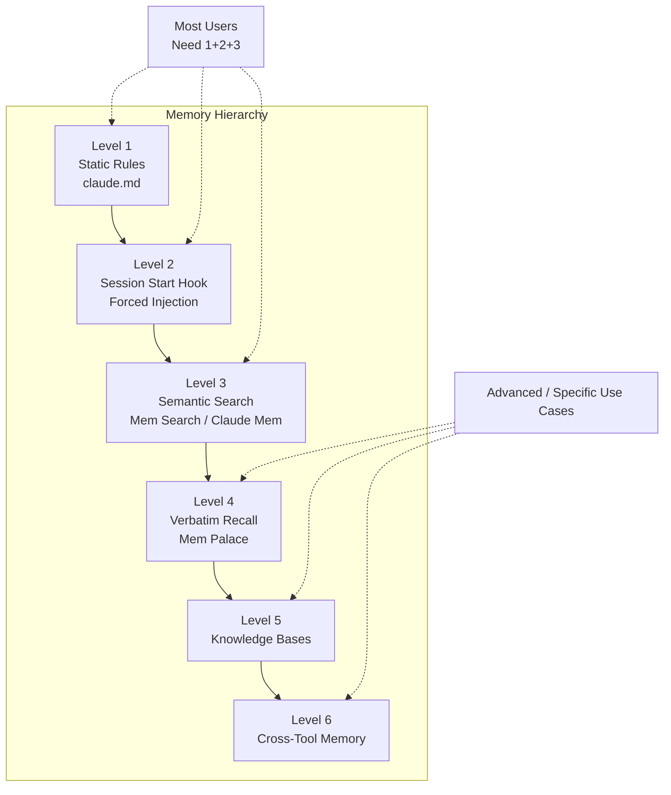

---

## 6. Architecture Overview: Clever Context Management with Folders and Files

At its core, an AgenticOS is not a codebase — it is an **organized information architecture**. The entire system can be understood as a clever arrangement of folders and files that govern what the AI knows and when.

> **[02:51]** "And the simplest way to think about all of this is that an Agentic OS is just clever context management. So it's all about folders, files, and a structure that tells your AI tool exactly what it needs to know, exactly when it needs to know it."

The architecture has three major input layers:

1. **Identity & Agent Context** — `user.md`, `soul.md`, and the master identity file
2. **Shared Brand Context** — business positioning, voice profiles, links
3. **Memory & Dynamic Context** — session recall, decisions, project history

These layers feed into **skills** and **skill systems** (chained workflows) that produce outputs in predictable locations. The architecture is also **portable** — as tools evolve, the underlying folder structure and context logic remains valid.

> **[23:40]** "You can just think about it as a structure that you're building to manage context under the hood for different use cases. And this architecture is completely portable. The tools are going to keep changing, but the underlying structure and the foundations that you built here today are going to stay true."

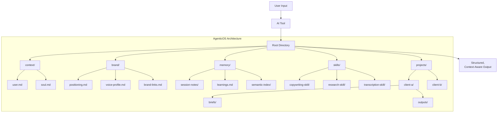

The genius of this design is that it leverages **context inheritance** from parent folders — a master `claude.md` at the root passes down shared methodology, while individual client folders can override or extend that context with client-specific instructions. This means you can run as many clients as you want without cross-contamination, while still sharing the core skills and processes that make your AI a specialist.

---

*Continue to Part 2 for Skills, Skill Systems, Planning Frameworks, Multi-Client Architecture, Predictable Outputs, and Remote Access.*
## 7. Process Specialization: From Generalist to Specialist

The fundamental challenge with LLMs is that they're designed to be **generalists**, not specialists in your specific workflows:

> **[11:15]** "AI models are designed out the box to be jack of all trades, not specialists."

> **[11:20]** "We actually have to teach it how to do those specialist processes through our skills."

This transformation from generalist to specialist happens through **modular skills**—self-contained instruction sets that encode your specific processes. The key insight is that skills should be **short and modular**, following the principle of **progressive disclosure**:

> **[11:43]** "The most important thing for your agentic operating system is keeping your skills short and modular."

> **[11:58]** "We want to keep this under 200 lines as we know for a fact that Claude can reliably recall this amount of information."

> **[12:20]** "Skills should also always reference your business context. So when your copywriting skill runs, it's not guessing your brand voice."

Each skill should be designed to **self-improve** through feedback loops:

> **[13:00]** "Every time a skill is used, it's going to ask you for feedback, you're going to give it feedback, and then every time it runs again, it's going to read the feedback first before it runs."

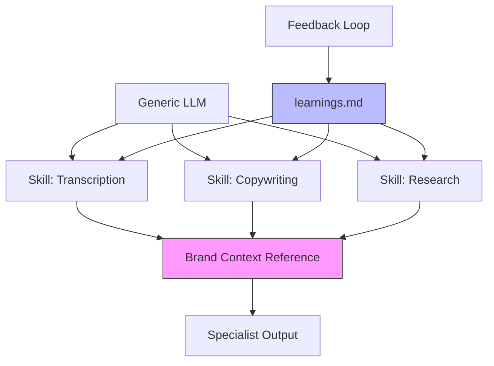

**Key Principles:**
- Keep skills **under 200 lines** for reliable recall
- Always **reference shared brand context**
- Build in **self-learning** through feedback files
- Design skills as **reusable components** that can be chained

---

## 8. Autonomous Workflows: Multi-Step Execution Without Supervision

The real power emerges when you stop thinking about skills in isolation and start **chaining them together** into autonomous pipelines:

> **[14:11]** "I want you to start thinking about your skills not as single isolated skills, but as part of a full pipeline or process."

> **[14:30]** "You're actually going to do is chain multiple of these skills together in a chain as it sounds."

> **[15:14]** "I want you to start thinking about skills as these modular components that you piece together on a schedule so that you don't have to be there when these skills run."

> **[15:21]** "That's really how you get your time back, right? You're using this as an autonomous skill loop."

A **skill system** orchestrates multiple skills in sequence, with optional **human-in-the-loop** checkpoints:

> **[16:08]** "They don't need to be completely autonomous. They can have multiple human in the loop steps as well."

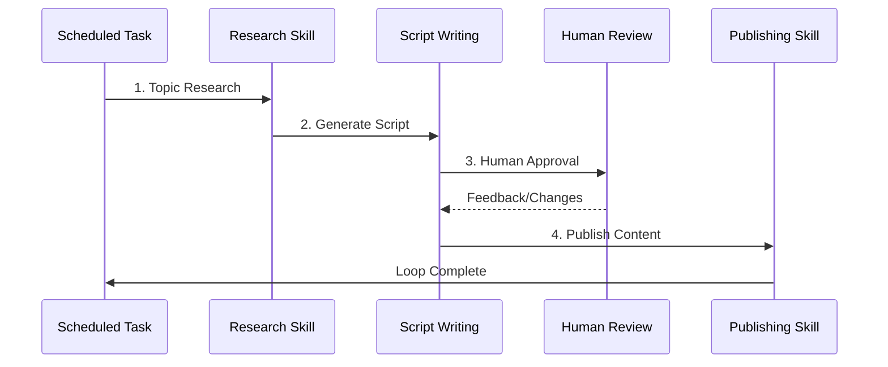

**Example Skill Systems:**
- **Content Generation Pipeline**: Research → Script → Video → Transcription → Repurpose → Post
- **SEO Optimization**: Keyword Research → Content Draft → GAO Page Optimization → Publish
- **Ad Campaign**: Market Analysis → Ad Copy → Creative Generation → Performance Monitoring

**Implementation Strategy:**
1. Start with **scheduled tasks** (via Claude desktop app or cron)
2. Build a **meta-skill orchestrator** to chain components
3. Insert **human review checkpoints** where quality matters most
4. Let the system **iterate autonomously** between checkpoints

---

## 9. Client Separation: Clean Architecture for Multiple Projects

When managing multiple clients or businesses, **context contamination** becomes a critical problem:

> **[18:36]** "What happens when you have five different layers with five different client contexts that you need to manage and inject into the right conversation at the right time?"

The solution is a **multi-client architecture** with **context inheritance**:

> **[18:46]** "Multi-client architecture that at the root folder level handles a lot of shared skills, shared scripts, shared methodology, but we can still retain the business context at a client level."

> **[19:04]** "We've used the inbuilt context inheritance from parent folders inside Claude Code."

> **[19:37]** "At each client level we have its own client brand context... individual brand context at that level."

> **[20:30]** "All of this inheritance of context means you can actually run as many clients as you want without inheriting the context from it all but still sharing the important stuff."

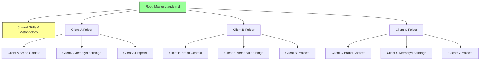

**Architecture Pattern:**
```
agentic-os/
├── claude.md (master - shared methodology)
├── skills/ (globally installed)
├── context/
│   └── brand/ (shared brand context)
└── clients/
    ├── client-a/
    │   ├── claude.md (client-specific overrides)
    │   ├── brand-context/
    │   ├── memory/
    │   └── projects/
    ├── client-b/
    └── client-c/
```

**Key Benefits:**
- **Shared methodology** flows down from root
- **Client-specific overrides** at each client folder level
- **Isolated memory** prevents cross-client contamination
- **Skills remain global** but reference client context dynamically

---

## 10. Predictable Outputs: File Structure and Organization

One of the most frustrating aspects of working with AI tools is **unpredictable output locations**:

> **[20:46]** "Outputs in one predictable place came from a personal limitation that I observed when I was getting so frustrated with producing a ton of outputs inside Claude Code."

> **[20:57]** "They store outputs wherever they want effectively. There's no constraints on where outputs are stored."

> **[21:17]** "We've just created a simple folder structured per project per skill."

> **[22:03]** "It's just a simple way to frame putting all the context of that specific client in a project folder so that you can see it all in one place."

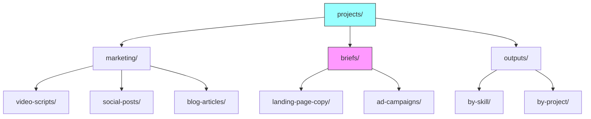

**Directory Structure:**
```
client-a/
└── projects/
    ├── marketing/
    │   ├── video-scripts/
    │   ├── social-posts/
    │   └── blog-articles/
    ├── briefs/
    │   ├── landing-page-copy/
    │   │   ├── brief.md
    │   │   └── output.md
    │   └── ad-campaigns/
    └── outputs/
        ├── by-skill/
        │   └── excalidraw-diagrams/
        └── by-project/
```

**Organizational Principles:**
- **Categorize by skill type** (marketing, development, design)
- **Store briefs alongside outputs** for full context
- **Create predictable paths** that skills can write to automatically
- **Mirror client structure** for easy navigation

---

## 11. Access from Anywhere: Remote Execution Capabilities

Your AgenticOS shouldn't be tethered to your laptop. The goal is **ubiquitous access**:

> **[22:21]** "You want the system to come with you."

> **[22:30]** "Get the system off your laptop."

> **[22:35]** "Running the system on a server and not on your laptop. You can use something like a VPS or literally use Claude Cloud to host it anywhere."

> **[23:12]** "Use Anthropic's built-in channels feature, which allows you to effectively talk from your phone via Telegram to the instance."

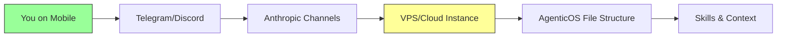

**Two-Part Solution:**

1. **Remote Hosting**
   - Deploy on a **VPS** or **Claude Cloud**
   - Scheduled tasks run **24/7** without your laptop
   - No need to keep your machine running continuously

2. **Access Layer**
   - Use **Anthropic Channels** (Telegram, Discord integration)
   - **CodeX**, **OpenClaude**, and **Hermes** have native support
   - Message from anywhere while maintaining **full file system access**

**Implementation Checklist:**
- [ ] Set up cloud instance (VPS or Claude Cloud)
- [ ] Configure **Anthropic Channels** for mobile access
- [ ] Ensure skills reference **absolute or synced paths**
- [ ] Test remote execution of scheduled tasks

---

## 12. Implementation Guide: Step-by-Step Build Instructions

Building your AgenticOS is an **iterative process**. Don't aim for perfection on day one:

> **[11:25]** "Build a scrappy MVP version of a skill, use it for a week, try and actually get good outputs with that process, notice what's broken, fix it all up."

> **[11:34]** "Don't try and make a perfect skill on day one."

> **[03:05]** "None of this is code. If you can organize a Notion workspace, then you can actually build this out for yourself, too."

> **[10:01]** "You can actually layer multiple of these concepts together with one file structure."

### Phase 1: Foundation (Day 1-2)

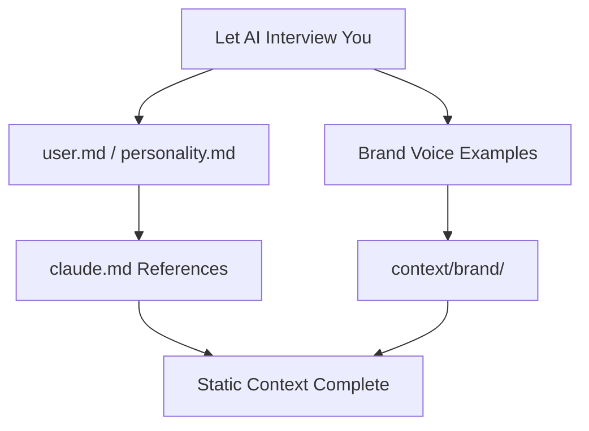

**Steps:**
1. **AI Interview**: Ask your AI tool: *"I'm building my identity file. Ask me 15 questions about how I work, what I want, what I don't want, how I want you to respond."*
2. **Generate user.md**: Capture your working style, preferences, and non-negotiables
3. **Create soul.md**: Define the agent's personality responding to you
4. **Build brand context**: Gather examples of your voice, positioning, ICP
5. **Reference in claude.md**: Link all context files for injection

### Phase 2: Memory Layer (Day 3-4)

**Steps:**
1. **Level 1**: Ensure claude.md loads consistently
2. **Level 2**: Add **session start hooks** to force context injection
3. **Level 3**: Implement **semantic search** (MemSearch, Claude Mem)
4. **Optional**: Add verbatim recall (MemPalace) for client work

### Phase 3: Skills & Processes (Week 1-2)

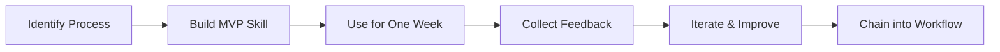

**Steps:**
1. **Identify repeatable processes** (transcription, copywriting, research)
2. **Build MVP skills** (under 200 lines each)
3. **Reference brand context** in every skill
4. **Add feedback loops** (learnings.md files)
5. **Chain skills** into multi-step workflows

### Phase 4: Multi-Client Architecture (Week 2-3)

**Steps:**
1. **Create root claude.md** with shared methodology
2. **Install skills globally** (or sync from root)
3. **Create client folders** with individual claude.md files
4. **Add client-specific brand context** per folder
5. **Set up isolated memory** per client

### Phase 5: Output Organization & Remote Access (Week 3-4)

**Steps:**
1. **Create projects/ structure** per client
2. **Define output paths** per skill type
3. **Configure skills** to write to predictable locations
4. **Set up cloud hosting** (VPS or Claude Cloud)
5. **Enable Anthropic Channels** for mobile access

---

## 13. Conclusion: Summary and Next Steps

Your AgenticOS is fundamentally about **context management**—a structure that tells your AI exactly what it needs to know, exactly when it needs to know it:

> **[23:40]** "You can just think about it as a structure that you're building to manage context under the hood for different use cases."

> **[23:45]** "This architecture is completely portable. The tools are going to keep changing, but the underlying structure and the foundations that you built here today are going to stay true."

> **[24:00]** "We'll still need to continue to build our own agentic operating system."

> **[24:06]** "You will learn a ton as you build that out."

### The Nine Pillars Recap

| # | Pillar | Purpose |
|---|--------|---------|
| 1 | **Identity & Brand Context** | Tell AI who you are and how you work |
| 2 | **Memory Systems** | Recall decisions across sessions |
| 3 | **Process Specialization** | Transform generalist LLM into specialist |
| 4 | **Autonomous Workflows** | Multi-step execution without supervision |
| 5 | **Planning Levels** | Match planning depth to project complexity |
| 6 | **Client Separation** | Clean architecture for multiple projects |
| 7 | **Predictable Outputs** | Organized file structure for all deliverables |
| 8 | **Remote Access** | Access your system from anywhere |
| 9 | **Iterative Improvement** | Self-learning through feedback loops |

### Two Paths Forward

**Build It Yourself:**
- Follow the implementation guide above
- Start with **static context** (identity + brand)
- Add **memory layer** incrementally
- Build **one skill per week**, iterate based on feedback
- Expect to learn significantly through the process

**Use an Off-the-Shelf System:**
- Install pre-built AgenticOS (e.g., Agentic Academy)
- **One-line install**, 10-minute setup
- Get to **70% version within 10 minutes**
- Iterate from a working baseline

### Final Thoughts

The tools will evolve—Claude Code, CodeX, OpenClaude, and others will continue to improve their native capabilities. But the **foundational architecture** you build today—the folder structures, the context management patterns, the skill systems—will remain valuable regardless of which tools you use tomorrow.

> **[24:19]** "Whichever one feels like the right path for you and then iterate from there."

The next frontier is **multi-step workflows on a schedule**—the topic of deeper exploration in follow-up content. But with these nine pillars in place, you now have a complete AgenticOS that produces **consistent, high-quality outputs 90% of the time**.

---

*Part 2 of 2 | Sections 7-13 | Based on transcript segments [11:10-24:34]*
---

## Appendix: Glossary

| Term | Definition |
|:-----|:-----------|
| **Agentic OS** | A structured context layer that sits between the user and the LLM, enabling persistent memory, specialized skills, and autonomous workflows |
| **Static Context** | Identity and brand information that rarely changes (user.md, soul.md, brand.md) |
| **Dynamic Context** | Session-specific, project-specific, or time-sensitive context that changes regularly |
| **Skill** | A self-contained instruction set (under 200 lines) that encodes a specific process |
| **Skill System** | An orchestrator that chains multiple skills into autonomous pipelines |
| **Context Contamination** | When information from one client or project leaks into another |
| **Progressive Disclosure** | Providing only the context needed at each step, rather than overwhelming the model |
| **Human-in-the-Loop** | Checkpoints where human approval is required before proceeding |

## References

- **Primary Source:** Simon Scrapes, "Creating Your Own Agentic OS is Easy (Insanely Powerful)", YouTube, 2026 — [w0S-khYCaB4](https://www.youtube.com/watch?v=w0S-khYCaB4)
- **Community:** [skool.com/scrapes](https://skool.com/scrapes)
- **Trading Desk Integration:** See [TI-011 Meta-Orchestration](../operational/planning/PLAN-2026-05-01-1645.md) and [TI-023 Orchestrator Health](../operational/planning/PLAN-2026-05-03-1930-TI023-AUTO-DECOMPOSE-NODE-DISPATCH.md)

---

*This document is a living specification. Updates should be tracked in the Trading Desk wiki and version control.*
