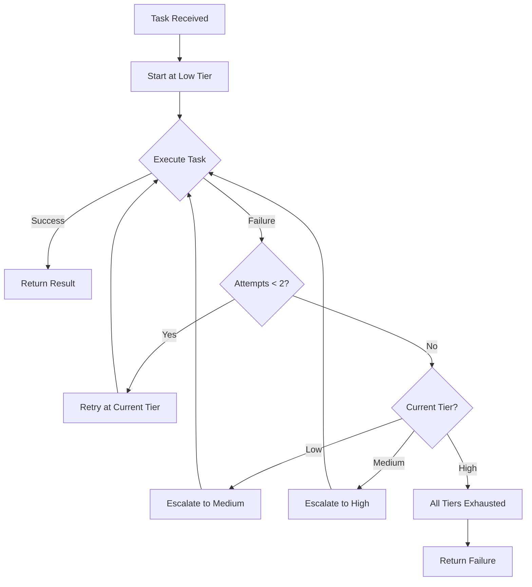

# Cloud Escalation System

**Version:** 1.0  
**Created:** 2026-05-05  
**Status:** Production Ready

---

## Overview

The Cloud Escalation System provides **automatic tiered escalation** when local execution or lower cloud tiers fail. It ensures tasks complete by progressively escalating through three cloud tiers with different cost/performance characteristics.

**Key Features:**
- 3-tier escalation (low → medium → high)
- Maximum 2 attempts per tier before escalation
- Cost tracking per tier
- Automatic fallback when all tiers exhausted
- Comprehensive logging

---

## Escalation Tiers

| Tier | Model | Cost per 1K Tokens | Priority | Use Case |
|------|-------|-------------------|----------|----------|
| **Low** | `ollama-cloud/qwen3.5:397b` | $0.011 | Normal | Standard tasks, cost-sensitive |
| **Medium** | `ollama-cloud/qwen3.5:397b` | $0.011 | High | Priority tasks, same model |
| **High** | `ollama-cloud/kimi-k2.6` | $0.055 | Critical | Complex reasoning, maximum capability |

**Cost Comparison:**
- Low/Medium tier: $0.011 per 1K tokens (~5x cheaper than high tier)
- High tier: $0.055 per 1K tokens (maximum capability)

---

## Escalation Logic



### Escalation Rules

1. **Start at Low Tier** — All tasks begin at the lowest cost tier
2. **Max 2 Attempts per Tier** — Retry once before escalating
3. **Escalate on Failure** — Move to next tier after max attempts
4. **Stop at High Tier** — No further escalation after high tier fails
5. **Log All Escalations** — Track cost and reason for each escalation

---

## Usage

### Command Line

```bash
# Basic usage
python3 technical-infrastructure/scripts/cloud_escalation.py \
  --task "deploy_app" \
  --tokens 2000

# Simulate failures for testing
python3 technical-infrastructure/scripts/cloud_escalation.py \
  --task "test_task" \
  --simulate-failure

# Start at specific tier
python3 technical-infrastructure/scripts/cloud_escalation.py \
  --task "complex_analysis" \
  --tier medium

# JSON output
python3 technical-infrastructure/scripts/cloud_escalation.py \
  --task "deploy_app" \
  --json
```

### Python API

```python
from cloud_escalation import CloudEscalationManager

# Create manager
manager = CloudEscalationManager(task_id="deploy_app_001")

# Define task
task = {
    'name': 'deploy_app',
    'tokens': 2000,
    'complexity': 7
}

# Execute with automatic escalation
result = manager.execute_with_escalation(task)

# Check result
if result['status'] == 'success':
    print(f"Completed at {result['tier_used']} tier")
    print(f"Total cost: ${result['total_cost']:.4f}")
else:
    print(f"Failed: {result['error']}")
```

---

## Cost Examples

### Example 1: Simple Task (Low Tier Success)

**Task:** `check_health`  
**Tokens:** 500  
**Tier:** Low (success on first attempt)

```
Cost: 500 tokens × $0.011/1K = $0.0055
Total: $0.0055
```

### Example 2: Complex Task (Medium Tier Success)

**Task:** `deploy_app`  
**Tokens:** 2000  
**Tier:** Low (2 failures) → Medium (success)

```
Low Tier Attempts: 2 × 2000 tokens × $0.011/1K = $0.044
Medium Tier: 2000 tokens × $0.011/1K = $0.022
Total: $0.066
```

### Example 3: Very Complex Task (High Tier Success)

**Task:** `complex_analysis`  
**Tokens:** 5000  
**Tier:** Low (2 failures) → Medium (2 failures) → High (success)

```
Low Tier Attempts: 2 × 5000 tokens × $0.011/1K = $0.110
Medium Tier Attempts: 2 × 5000 tokens × $0.011/1K = $0.110
High Tier: 5000 tokens × $0.055/1K = $0.275
Total: $0.495
```

---

## Integration Points

### Health-Aware Execution

Cloud escalation integrates with the health-aware execution system:

```python
from health_aware_executor import HealthAwareExecutor
from cloud_escalation import CloudEscalationManager

executor = HealthAwareExecutor()
health = executor.check_health()

if health['status'] == 'critical':
    # Direct to high tier
    manager = CloudEscalationManager(task_id)
    manager.current_tier = 'high'
    result = manager.execute_with_escalation(task)
elif health['status'] == 'stressed':
    # Decompose + cloud low tier
    result = executor.decompose_and_route(task, tier='low')
else:
    # Execute locally
    result = executor.execute_local(task)
```

### Binary Decomposition

For large tasks, combine with binary decomposition:

```python
from binary_decompose import binary_decompose
from cloud_escalation import CloudEscalationManager

# Decompose large task
sub_tasks = binary_decompose(task, max_depth=2)

# Execute each sub-task with escalation
manager = CloudEscalationManager(task_id)
results = []
for sub_task in sub_tasks:
    result = manager.execute_with_escalation(sub_task)
    results.append(result)

# Synthesize results
from task_synthesizer import synthesize
final_result = synthesize(results)
```

---

## Logging

### Log Format

All escalations are logged to `cloud-escalation.jsonl`:

```json
{
  "timestamp": "2026-05-05T14:30:00Z",
  "task_id": "deploy_app_001",
  "tier": "low",
  "model": "ollama-cloud/qwen3.5:397b",
  "tokens": 2000,
  "cost": 0.022,
  "status": "failed",
  "error": "Context window exceeded",
  "escalated_to": "medium"
}
```

### Log Analysis

```bash
# View recent escalations
tail -20 wiki/operational/sessions/cloud-escalation.jsonl

# Count escalations by tier
cat wiki/operational/sessions/cloud-escalation.jsonl | jq -r '.tier' | sort | uniq -c

# Calculate total cost
cat wiki/operational/sessions/cloud-escalation.jsonl | jq -s 'map(.cost) | add'
```

---

## Troubleshooting

### Issue 1: Frequent Escalations to High Tier

**Symptom:** Most tasks escalate to high tier, costs increasing

**Causes:**
- Task complexity underestimated
- Token limits too low for tier
- Model capability mismatch

**Resolution:**
```bash
# Analyze escalation patterns
cat wiki/operational/sessions/cloud-escalation.jsonl | \
  jq -r 'select(.escalated_to != null) | .task_id' | \
  sort | uniq -c | sort -rn | head -10

# Check task complexity estimates
# Adjust complexity ratings for frequently-escalating tasks
```

### Issue 2: All Tiers Exhausted

**Symptom:** Task fails after all tiers exhausted

**Causes:**
- Task fundamentally incompatible with available models
- Error in task definition
- Network/API issues

**Resolution:**
```bash
# Check error messages
cat wiki/operational/sessions/cloud-escalation.jsonl | \
  jq -r 'select(.status == "failed") | .error' | \
  sort | uniq -c

# Verify task definition
# Check network connectivity to cloud APIs
# Consider manual execution or task redesign
```

### Issue 3: Unexpected Costs

**Symptom:** Costs higher than expected

**Causes:**
- Token count underestimated
- Multiple escalations
- Retry attempts accumulating

**Resolution:**
```bash
# Review cost breakdown
cat wiki/operational/sessions/cloud-escalation.jsonl | \
  jq -s 'group_by(.task_id) | map({task: .[0].task_id, total_cost: (map(.cost) | add)})'

# Adjust token estimates
# Implement stricter task size limits
# Consider pre-task complexity analysis
```

---

## Best Practices

### Do's

✅ **Start at low tier** — Always begin with lowest cost option  
✅ **Monitor escalation patterns** — Track which tasks escalate frequently  
✅ **Set token limits** — Prevent runaway costs  
✅ **Log all escalations** — Maintain audit trail  
✅ **Review costs weekly** — Identify optimization opportunities  

### Don'ts

❌ **Skip low tier** — Don't start at medium/high without justification  
❌ **Ignore escalation patterns** — Frequent escalations indicate issues  
❌ **Set unlimited tokens** — Always cap token usage  
❌ **Disable logging** — Logging is critical for cost tracking  
❌ **Escalate indefinitely** — Max 2 attempts per tier, then escalate or fail  

---

## Performance Metrics

| Metric | Target | Measurement |
|--------|--------|-------------|
| Low tier success rate | >70% | `% of tasks completing at low tier` |
| Escalation rate | <30% | `% of tasks requiring escalation` |
| High tier usage | <10% | `% of tasks reaching high tier` |
| Average cost per task | <$0.05 | `Total cost / Total tasks` |
| Max attempts before success | <4 | `Average attempts across all tasks` |

---

## Related Documents

- [Health Check Integration](./health-check-integration.md)
- [Binary Decomposition](./binary-decomposition.md)
- [Master Prompt Guide](./master-prompt-guide.md)
- [TI-031 Integration Plan](../../operational/planning/TI031-TI032-INTEGRATION-MASTER-PROMPT.md)

---

**Document Owner:** Technical Infrastructure Team  
**Review Cycle:** Monthly  
**Next Review:** 2026-06-05
