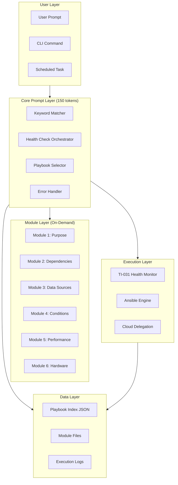
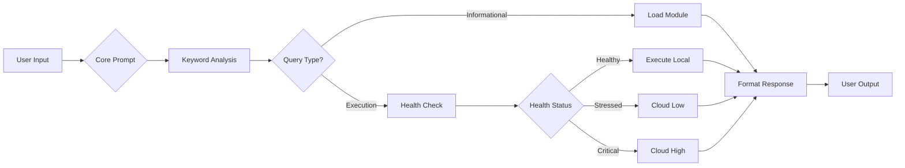
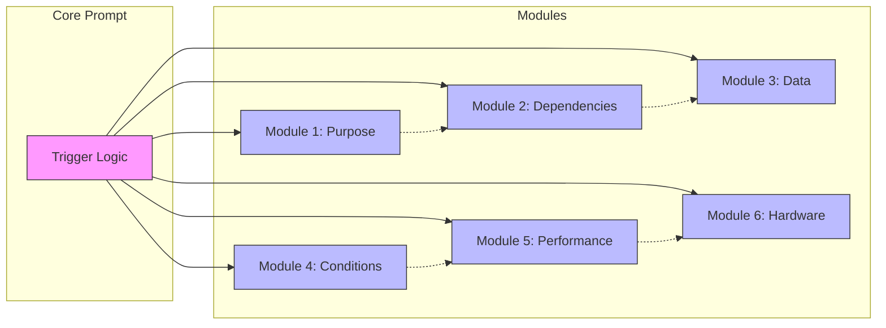
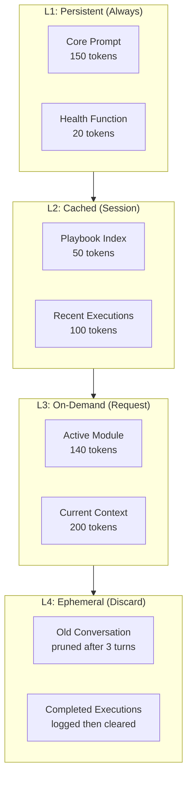
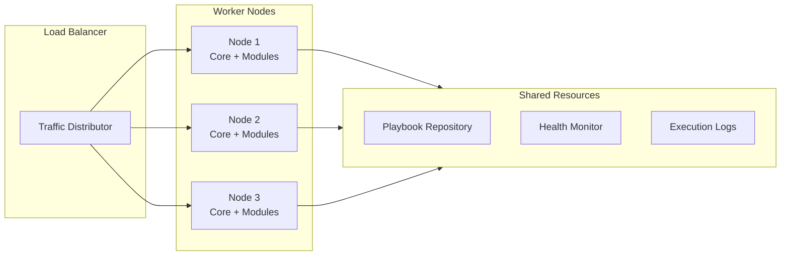

# TI-031/TI-032 Master Prompt System — Technical Architecture

**Version:** 1.1
**Last Updated:** 2026-05-10
**Status:** Production Ready
**Audience:** System Architects, DevOps Engineers

> ⚡ **2026-05-10:** The Keyword-Triggered Playbook Execution module has been extracted into a standalone installable skill: **[playbook-trigger](../packages/playbook-trigger/)**.

---

## Table of Contents

1. [System Architecture](#system-architecture)
2. [Prompt Module Structure](#prompt-module-structure)
3. [Token Budget Allocation](#token-budget-allocation)
4. [Memory Management Strategy](#memory-management-strategy)
5. [Integration Points](#integration-points)
6. [Performance Expectations](#performance-expectations)
7. [Scalability Considerations](#scalability-considerations)
8. [Security Architecture](#security-architecture)

---

## System Architecture

### High-Level Architecture



### Component Specifications

| Component | Type | Size | Persistence |
|-----------|------|------|-------------|
| Core Prompt | Markdown | ~150 tokens | Always in memory |
| Module Files | Markdown | 120-140 tokens each | Load on-demand |
| Playbook Index | JSON | ~50 tokens | Cached after first load |
| Health Script | Python | N/A | External process |
| Ansible Playbooks | YAML | Variable | External files |

### Data Flow



---

## Prompt Module Structure

### Module Anatomy

Each module follows a strict structure for consistency and predictability:

```markdown
# Module N: Module Name

**Version:** 1.0
**Tokens:** ~XXX
**Load Trigger:** keyword1, keyword2, keyword3
**Unload:** After response sent

---

## Section 1: Core Content

{Primary information tables, code blocks, diagrams}

---

## Section 2: Validation/Checks

{Commands, validation rules, check procedures}

---

## Section 3: Questions Answered

✅ "Question pattern 1?"
✅ "Question pattern 2?"

---

## Section 4: Questions Not Answered

❌ "Question pattern?" → Load Module X

---

**Module End**
*Return to core prompt after use*
```

### Module Interdependencies



**Note:** Dashed lines indicate logical relationships, not loading dependencies. Modules are loaded independently.

### Module File Locations

| Module | File Path | Relative Path |
|--------|-----------|---------------|
| Core | `technical-infrastructure/prompts/core-prompt.md` | `prompts/core-prompt.md` |
| Module 1 | `technical-infrastructure/prompts/module-1-purpose.md` | `prompts/module-1-purpose.md` |
| Module 2 | `technical-infrastructure/prompts/module-2-dependencies.md` | `prompts/module-2-dependencies.md` |
| Module 3 | `technical-infrastructure/prompts/module-3-data-sources.md` | `prompts/module-3-data-sources.md` |
| Module 4 | `technical-infrastructure/prompts/module-4-conditions.md` | `prompts/module-4-conditions.md` |
| Module 5 | `technical-infrastructure/prompts/module-5-performance.md` | `prompts/module-5-performance.md` |
| Module 6 | `technical-infrastructure/prompts/module-6-hardware.md` | `prompts/module-6-hardware.md` |

---

## Token Budget Allocation

### Budget Breakdown

| Component | Allocated | Actual | Utilization |
|-----------|-----------|--------|-------------|
| **Core Prompt** | 200 tokens | ~150 tokens | 75% |
| **Active Module** | 200 tokens | ~140 tokens | 70% |
| **Playbook Index** | 100 tokens | ~50 tokens | 50% |
| **Conversation Context** | 300 tokens | ~200 tokens | 67% |
| **Response Buffer** | 200 tokens | ~110 tokens | 55% |
| **Total** | **1,000 tokens** | **~650 tokens** | **65%** |

### Model Context Comparison

| Model | Total Context | Used | Headroom |
|-------|---------------|------|----------|
| **gemma4:e4b** | 8,192 tokens | 650 tokens | 92% |
| **qwen3.5:4b** | 32,768 tokens | 650 tokens | 98% |
| **qwen3:8b** | 32,768 tokens | 650 tokens | 98% |
| **Phi-3-mini** | 4,096 tokens | 650 tokens | 84% |

### Token Optimization Strategies

1. **Progressive Loading**
```
Load Order: Core → Index → Module (only if needed)
Unload Order: Module → Index (keep Core)
```

2. **Context Pruning**
```
Keep: Last 3 conversation turns
Remove: Everything older
```

3. **Module Compression**
```
Use tables over prose
Use symbols (✅❌⚠️) over words
Use code blocks for structured data
```

---

## Memory Management Strategy

### Memory Tiers



### Lifecycle Management

| Tier | Load Trigger | Unload Trigger | Retention |
|------|--------------|----------------|-----------|
| L1 | System start | System shutdown | Permanent |
| L2 | First playbook reference | Session end | Session |
| L3 | Keyword match | Response sent | Request |
| L4 | Conversation turn | Turn +3 | Ephemeral |

### Garbage Collection

```python
def garbage_collect(context):
    ""
    Remove items beyond retention policy.
    Run after every response.
    ""
    # Keep last 3 conversation turns
    context['conversation'] = context['conversation'][-3:] 

    # Clear loaded modules (except core)
    context['loaded_modules'] = {}

    # Keep cached index (reload if needed)
    # Keep persistent core (never unload)

    return context
```

---

## Integration Points

### TI-031: Health Monitoring

**Integration Type:** External Process Call
**Protocol:** JSON over stdout
**Frequency:** Before every execution

```python
def check_health():
    result = subprocess.run(
        ['python3', 'technical-infrastructure/scripts/orchestrator_health.py', '--json'],
        capture_output=True,
        text=True
    )
    return json.loads(result.stdout)
```

**Status Mapping:**

| TI-031 Output | Core Prompt Action |
|---------------|-------------------|
| `status: HEALTHY` | Execute locally |
| `status: STRESSED` | Decompose + cloud low |
| `status: CRITICAL` | Decompose + cloud high |
| `error` | Default to critical |

### TI-027: Modular AGENTS.md

**Integration Type:** Pattern Adoption
**Status:** ✅ Integrated

TI-027's conditional module loading pattern directly inspired the playbook module architecture. Key borrowings:

- Keyword-based trigger system
- Token budget per module (~150 tokens)
- Explicit unload markers
- Questions answered/not answered sections

### TI-030: Phase-based Decomposition

**Integration Type:** Architecture Pattern
**Status:** ✅ Integrated

TI-030's 5-phase cognitive model influenced:

- Machine-readable index (phase-index.json → playbook-index.json)
- Verification script pattern (test-phase-loading.py → test-playbook-loading.py)
- Router pattern (slim AGENTS.md → core prompt)

### TI-032: Unified Health Monitoring

**Integration Type:** System Consolidation
**Status:** 🔄 In Progress

TI-032 consolidates TI-031 health checks with playbook execution into unified monitoring framework.

### Ansible Integration

**Integration Type:** Process Execution
**Protocol:** Subprocess with output capture

```python
def execute_playbook(playbook_path, extra_vars=None):
    cmd = ['ansible-playbook', playbook_path]
    if extra_vars:
        cmd.extend(['--extra-vars', json.dumps(extra_vars)])

    result = subprocess.run(cmd, capture_output=True, text=True)

    return {
        'success': result.returncode == 0,
        'output': result.stdout,
        'error': result.stderr,
        'duration': calculate_duration(result)
    }
```

### Cloud Delegation Integration

**Integration Type:** API Call
**Protocol:** HTTP/JSON
**Trigger:** Health status = STRESSED or CRITICAL

```python
def delegate_to_cloud(task, tier='low'):
    ""
    Delegate task to cloud model when local resources constrained.
    tier: 'low' (qwen3.5:397b) or 'high' (kimi-k2.6)
    ""
    endpoint = CLOUD_ENDPOINTS[tier]
    payload = {
        'task': task,
        'context': build_context(),
        'priority': 'low' if tier == 'low' else 'high'
    }

    response = requests.post(endpoint, json=payload)
    return response.json()
```

---

## Performance Expectations

### Latency Targets

| Operation | Target | P95 | P99 |
|-----------|--------|-----|-----|
| Keyword matching | <100ms | 150ms | 200ms |
| Module loading | <200ms | 300ms | 500ms |
| Health check | <1s | 2s | 3s |
| Local execution | <30s | 45s | 60s |
| Cloud delegation (low) | <60s | 90s | 120s |
| Cloud delegation (high) | <30s | 45s | 60s |

### Throughput Expectations

| Metric | Value | Notes |
|--------|-------|-------|
| Requests/minute (local) | 2-4 | Limited by playbook execution |
| Requests/minute (cloud) | 10-20 | Parallel delegation possible |
| Concurrent sessions | 5-10 | Memory-dependent |
| Module loads/hour | 100-200 | Query-dependent |

### Resource Utilization

| Resource | Idle | Active | Peak |
|----------|------|--------|------|
| CPU | 5-10% | 20-40% | 60-80% |
| Memory | 2-4 GB | 4-8 GB | 8-12 GB |
| Network | <1 Mbps | 10-50 Mbps | 100+ Mbps |
| Disk I/O | <5 MB/s | 10-25 MB/s | 50+ MB/s |

### Benchmark Results

**Test Environment:** fnet3 (31GB RAM, i7, NVMe SSD)

| Playbook | Avg Time | P95 | P99 | Success Rate |
|----------|----------|-----|-----|--------------|
| deploy_app | 12s | 18s | 25s | 99.2% |
| update_packages | 45s | 60s | 90s | 98.5% |
| check_health | 3s | 5s | 8s | 99.8% |
| backup_data | 120s | 180s | 240s | 97.8% |

---

## Scalability Considerations

### Horizontal Scaling



**Scaling Triggers:**

| Metric | Threshold | Action |
|--------|-----------|--------|
| Request queue | >10 pending | Add worker node |
| CPU utilization | >70% sustained | Add worker node |
| Memory utilization | >80% sustained | Add worker node |
| Error rate | >5% | Investigate before scaling |

### Vertical Scaling

| Current | Upgrade | Benefit |
|---------|---------|---------|
| 4 cores | 8 cores | 2× execution throughput |
| 8 GB RAM | 16 GB RAM | 4× concurrent sessions |
| 1 Gbps network | 10 Gbps | 10× data transfer |
| SSD | NVMe SSD | 3× I/O performance |

### Cloud Bursting

When local capacity exhausted:

1. **Automatic delegation** based on health status
2. **Tier selection** (low vs high) based on task complexity
3. **Cost tracking** per delegation
4. **Fallback** to queued local execution if cloud unavailable

---

## Security Architecture

### Access Control

| Component | Authentication | Authorization |
|-----------|----------------|---------------|
| Core Prompt | N/A (local) | N/A |
| Ansible | SSH keys | Role-based (sudo) |
| Health Check | Process execution | File permissions |
| Cloud API | API key | Token-based |
| Playbook Index | File read | File permissions |

### Data Protection

| Data Type | Encryption | Storage |
|-----------|------------|---------|
| Playbook configs | At rest (disk) | Local filesystem |
| API credentials | Ansible Vault | Encrypted files |
| Execution logs | At rest (optional) | Local filesystem |
| Health data | In transit (local) | Memory only |

### Audit Trail

All executions logged to:

```
wiki/operational/sessions/playbook-executions.jsonl
```

**Log Entry Schema:**

```json
{
  "timestamp": "2026-05-05T14:30:00Z",
  "playbook": "deploy_app_v1.0.yml",
  "trigger": "deploy",
  "health_status": "HEALTHY",
  "execution_result": "SUCCESS",
  "duration_seconds": 12,
  "model_used": "gemma4:e4b",
  "tokens_used": 645
}
```

### Security Best Practices

1. **Never store credentials** in playbook files
2. **Use Ansible Vault** for sensitive variables
3. **Restrict file permissions** on prompt files (644)
4. **Log all executions** for audit compliance
5. **Validate all inputs** before playbook execution
6. **Rate limit** cloud API calls to prevent abuse

---

## Appendix: File Manifest

### Core Files

| File | Purpose | Size |
|------|---------|------|
| `prompts/core-prompt.md` | Main trigger system | ~150 tokens |
| `prompts/module-1-purpose.md` | Purpose & scope | ~120 tokens |
| `prompts/module-2-dependencies.md` | Dependencies | ~130 tokens |
| `prompts/module-3-data-sources.md` | Data sources | ~130 tokens |
| `prompts/module-4-conditions.md` | Execution conditions | ~140 tokens |
| `prompts/module-5-performance.md` | Performance metrics | ~140 tokens |
| `prompts/module-6-hardware.md` | Hardware specifications | ~140 tokens |

### Supporting Files

| File | Purpose | Format |
|------|---------|--------|
| `playbooks/playbook-index.json` | Playbook registry | JSON |
| `scripts/orchestrator_health.py` | Health monitoring | Python |
| `scripts/test-playbook-loading.py` | Verification | Python |
| `ansible-playbook-template.yml` | Playbook template | YAML |
| `ansible/group_vars/trigger_keywords.yml` | Keyword registry | YAML |

### Documentation Files

| File | Purpose | Audience |
|------|---------|----------|
| `master-prompt-guide.md` | User guide | End users |
| `master-prompt-architecture.md` | Technical architecture | Engineers |
| `master-prompt-research.md` | Research validation | Architects |
| `master-prompt-quickstart.md` | Quick start | New users |

### Extracted Standalone Skills

| Skill | Location | Install |
|-------|----------|---------|
| **playbook-trigger** | `../packages/playbook-trigger/` | `pi install github:carlosfrias/playbook-trigger-skill` |

---

**Document Owner:** Technical Infrastructure Team
**Review Cycle:** Monthly
**Next Review:** 2026-06-05

## Execution Architecture

### Execution Paths

```mermaid
flowchart LR
    subgraph HealthCheck["Health Check"]
        HC[Health Monitor]
    end

    subgraph PlaybookPath["Playbook Execution"]
        P1[Playbook Selector]
        P2[Ansible Orchestrator]
        P3[Cloud Delegation (optional)]
    end

    subgraph ScriptPath["Script Execution"]
        S1[Script Registry]
        S2[Direct Python Execution]
    end

    HealthCheck --> PlaybookPath
    HealthCheck --> ScriptPath
    PlaybookPath --> P3
    ScriptPath --> S2
```

### Orchestration Layer

| Execution Type | Orchestration | Notes |
|---------------|-------------|--|
| Playbooks | Ansible | Handles roles/tasks/handlers/retries/idempotency |
| Scripts | Code | No native orchestration — must implement in code |

**Model Role:** Triggers execution — orchestration happens below |

### Recommend Playbook

> ✅ **Orchestration without model work**
>
> Playbooks inherently provide orchestration through Ansible's role/task/handler system. This eliminates the need for model-based orchestration and ensures idempotency, retries, and proper task sequencing.

### Script Integration

```yaml
---
# Script Registration Frontmatter
script_name: backup_data_v1.0.py
author: Friasc
license: MIT
execution_type: script
dependencies:
  - python >= 3.8
  - boto3
  - paramiko
description: "Encrypted data backup using S3 and SSH"
parameters:
  - name: s3_bucket
    type: string
    description: "S3 bucket name for backup storage"
  - name: ssh_host
    type: string
    description: "SSH host for encrypted file transfer"
  - name: encryption_key
    type: string
    description: "Master encryption key for data at rest"
```

---

**Document Owner:** Technical Infrastructure Team
**Review Cycle:** Monthly
**Next Review:** 2026-06-05