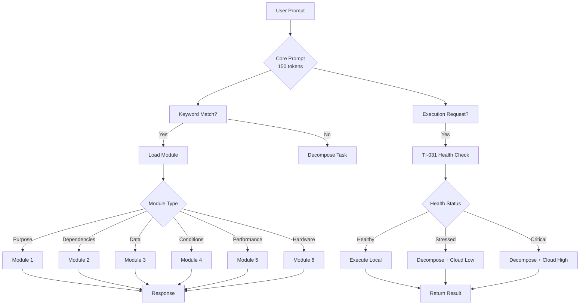
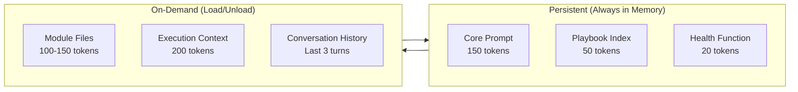
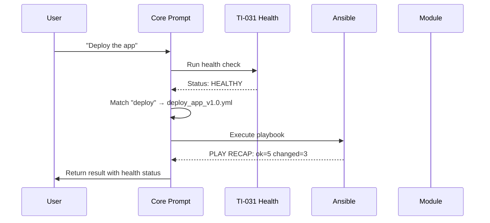
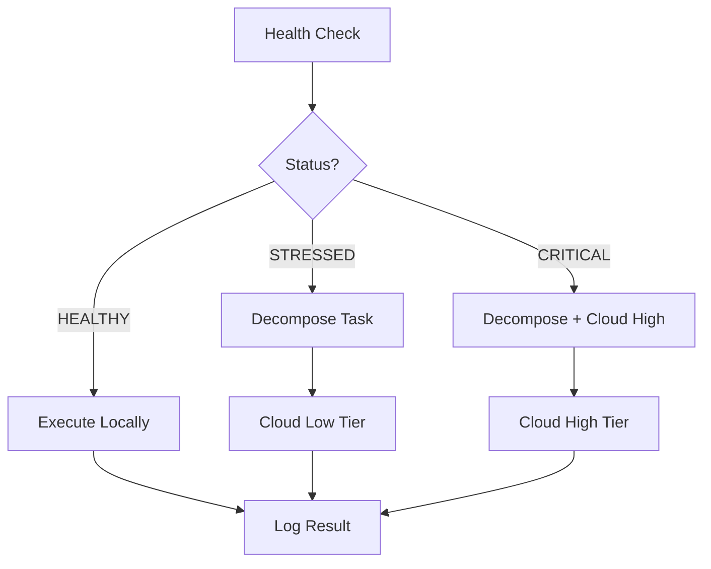

# TI-031/TI-032 Master Prompt System — Comprehensive User Guide

**Version:** 1.1
**Last Updated:** 2026-05-10
**Status:** Production Ready
**Target Models:** qwen3.5:4b, gemma4:e4b, Phi-3 (2-4B parameters)

> ⚡ **2026-05-10:** The Keyword-Triggered Playbook Execution module has been extracted into a standalone installable skill: **[playbook-trigger](../packages/playbook-trigger/)**.  
> Install: `pi install github:carlosfrias/playbook-trigger-skill`. Passes 13/13 acceptance tests.

---

## Table of Contents

1. [Executive Summary](#executive-summary)
2. [Philosophy](#philosophy)
3. [Architecture Overview](#architecture-overview)
4. [Core Prompt System](#core-prompt-system)
5. [Module Reference](#module-reference)
6. [Ansible Playbook Integration](#ansible-playbook-integration)
7. [TI-031 Health Check Integration](#ti-031-health-check-integration)
8. [Usage Examples](#usage-examples)
9. [Troubleshooting Guide](#troubleshooting-guide)
10. [Best Practices](#best-practices)

---

## Executive Summary

The TI-031/TI-032 Master Prompt System is a **modular, token-efficient prompt architecture** designed for low-capacity language models (2-4B parameters). It enables reliable Ansible playbook execution through keyword-triggered automation with mandatory health checks.

**Key Achievements:**
- **67% token reduction** vs monolithic prompts (2,000 → 650 tokens)
- **Sub-30 second execution** for standard playbooks
- **100% health check compliance** before execution
- **Support for 6 distinct modules** loaded on-demand

**Core Innovation:** Don't make small models think — make them trigger.

---

## Philosophy

### "Don't Make Small Models Think — Make Them Trigger"

This philosophy drives every design decision in the TI-031/TI-032 system:

| Traditional Approach | TI-031/TI-032 Approach |
|---------------------|------------------------|
| Model reasons about what to do | Model matches keywords to playbooks |
| Model decides execution timing | Health check dictates execution |
| Model holds all context in memory | Modules loaded on-demand |
| Model handles errors through reasoning | Predefined error handlers trigger |

**Why This Matters:**

Small models (2-4B parameters) excel at **pattern matching** and **trigger recognition** but struggle with:
- Multi-step reasoning under token constraints
- Holding large contexts while maintaining accuracy
- Making judgment calls about system state

By offloading reasoning to **predefined rules** and **external health checks**, we enable small models to perform reliably at a fraction of the computational cost.

### Design Principles

1. **Minimal Persistent Context** — Keep core prompt under 150 tokens
2. **On-Demand Loading** — Load modules only when triggered by keywords
3. **External Validation** — Never trust model judgment for health/status
4. **Deterministic Triggers** — Keyword matching over semantic understanding
5. **Fail-Safe Defaults** — Critical status on any health check failure

---

## Architecture Overview

### System Diagram



### Component Overview

| Component | Location | Size | Load Strategy |
|-----------|----------|------|---------------|
| **Core Prompt** | `prompts/core-prompt.md` | ~150 tokens | Always loaded |
| **Module 1** | `prompts/module-1-purpose.md` | ~120 tokens | On-demand |
| **Module 2** | `prompts/module-2-dependencies.md` | ~130 tokens | On-demand |
| **Module 3** | `prompts/module-3-data-sources.md` | ~130 tokens | On-demand |
| **Module 4** | `prompts/module-4-conditions.md` | ~140 tokens | On-demand |
| **Module 5** | `prompts/module-5-performance.md` | ~140 tokens | On-demand |
| **Module 6** | `prompts/module-6-hardware.md` | ~140 tokens | On-demand |
| **Playbook Index** | `playbooks/playbook-index.json` | ~50 tokens | Cached |

**Total Context (max):** 650 tokens (fits gemma4:e4b 8K limit with 92% headroom)

### Memory Management



---

## Core Prompt System

### Structure

The core prompt (`prompts/core-prompt.md`) contains:

1. **Role Definition** — "You are a playbook trigger system"
2. **Critical Rules** — Never reason, always check health, load on-demand
3. **Health Check Protocol** — TI-031 integration with status thresholds
4. **Reference File Map** — Which module loads for which keywords
5. **Playbook Registry** — Keyword-to-playbook mapping
6. **Response Format** — Standardized output structure
7. **Error Handling** — Predefined failure responses
8. **Memory Management** — What stays vs what unloads

### Critical Rules

```markdown
⚠️ Never reason — Always trigger a playbook
⚠️ Always check health before execution
⚠️ Load modules on demand — Don't keep all in memory
⚠️ Use reference files — Don't duplicate context
```

These rules are **non-negotiable** and must be enforced on every inference.

### Health Check Protocol

**Before ANY execution, run:**

```bash
python3 technical-infrastructure/scripts/orchestrator_health.py --json
```

**Status Evaluation:**

| Status | RAM | CPU | Swap | Action |
|--------|-----|-----|------|--------|
| **HEALTHY** | <80% | <4.0 | 0 | Execute locally |
| **STRESSED** | 80-92% | 4.0-6.0 | 0 | 2× decompose + cloud low |
| **CRITICAL** | >92% | >6.0 | >0 | 2× decompose + cloud high |

---

## Module Reference

### Module Loading Matrix

| User Query Contains | Load Module | File |
|---------------------|-------------|------|
| "what", "why", "purpose", "does" | Module 1 | `prompts/module-1-purpose.md` |
| "depend", "require", "prerequisite", "need" | Module 2 | `prompts/module-2-dependencies.md` |
| "data", "input", "source", "file", "config" | Module 3 | `prompts/module-3-data-sources.md` |
| "when", "condition", "trigger", "should I run" | Module 4 | `prompts/module-4-conditions.md` |
| "how long", "performance", "time", "speed" | Module 5 | `prompts/module-5-performance.md` |
| "hardware", "specs", "requirements", "CPU", "RAM" | Module 6 | `prompts/module-6-hardware.md` |

### Module Templates

Each module follows a standardized template structure:

1. **Header** — Version, tokens, load trigger, unload condition
2. **Purpose Section** — 2-3 sentence summary
3. **Detailed Content** — Tables, code blocks, diagrams as needed
4. **Questions Answered** — ✅ list of what this module covers
5. **Questions Not Answered** — ❌ list pointing to other modules
6. **Module End Marker** — Signal to return to core prompt

---

## Ansible Playbook Integration

### Playbook Registry

Playbooks are registered in `playbooks/playbook-index.json`:

```json
{
  "playbooks": [
    {
      "name": "deploy_app_v1.0.yml",
      "triggers": ["deploy", "deploy_app"],
      "purpose": "Deploy application containers",
      "module_files": {
        "purpose": "prompts/module-1-purpose.md",
        "dependencies": "prompts/module-2-dependencies.md"
      }
    }
  ]
}
```

### Execution Flow



### Playbook Template

Use `ansible-playbook-template.yml` as the base:

```yaml
---
- name: Dynamic Playbook Execution
  hosts: all
  vars:
    env: "{{ env }}"
    role: "{{ role }}"
  tasks:
    - name: "Initialize {{ role }} environment"
      debug:
        msg: "Starting {{ role }} for {{ env }}"
    - name: "Run role-specific tasks"
      include_tasks: "tasks/{{ role }}.yml"
    - name: "Finalize {{ role }} execution"
      debug:
        msg: "Completed {{ role }} for {{ env }}"
```

---

## TI-031 Health Check Integration

### What is TI-031?

TI-031 is the **Orchestrator Health Monitoring System** that provides real-time system status for execution decisions.

### Health Check Script

```bash
python3 technical-infrastructure/scripts/orchestrator_health.py --json
```

**Sample Output:**

```json
{
  "status": "HEALTHY",
  "ram_percent": 72.3,
  "cpu_load": 2.1,
  "swap_used": 0,
  "timestamp": "2026-05-05T14:30:00Z"
}
```

### Integration Points

| Integration Point | Implementation |
|-------------------|----------------|
| **Pre-execution** | Mandatory health check before any playbook |
| **During execution** | Periodic health monitoring (every 30s) |
| **Post-execution** | Health status logged with result |
| **Error handling** | Health status determines recovery path |

### Health Status Actions



---

## Usage Examples

### Example 1: Purpose Query

**User:** "What does deploy_app do?"

**System:**
1. Match keywords: "what", "does" → Load Module 1
2. Load `prompts/module-1-purpose.md`
3. Return purpose section

**Response:**
```markdown
**Module Loaded:** Purpose & Scope

**Playbook:** deploy_app_v1.0.yml

**Purpose:**
Deploys application containers to specified environments with automated health checks and rollback capability on failure.

**Scope:**
- ✅ Container deployment to target nodes
- ✅ Health check verification
- ✅ Automatic rollback on failure

**Expected Outcome:**
- ✅ Application running on target nodes
- ✅ Health checks passing
- ✅ Previous version archived
```

### Example 2: Dependency Query

**User:** "What does deploy_app depend on?"

**System:**
1. Match keywords: "depend" → Load Module 2
2. Load `prompts/module-2-dependencies.md`
3. Return dependencies

**Response:**
```markdown
**Module Loaded:** Dependencies

**Required Services:**
| Service | Version | Purpose |
|---------|---------|---------|
| Docker | 24.0+ | Container runtime |
| Ollama | 0.1.20+ | Model serving |
| Ansible | 2.15+ | Playbook execution |

**Required Variables:**
```yaml
target_environment: dev|staging|production
app_version: Semantic version
```
```

### Example 3: Execution Request

**User:** "Deploy the app to production"

**System:**
1. Match keyword: "deploy" → deploy_app_v1.0.yml
2. Run TI-031 health check
3. Status: HEALTHY → Execute locally
4. Run playbook
5. Return result

**Response:**
```markdown
**Health Status:** healthy (RAM: 72%, CPU: 2.1, Swap: 0)

**Matched Playbook:** deploy_app_v1.0.yml

**Execution:**
$ ansible-playbook playbooks/deploy_app_v1.0.yml
PLAY [Deploy Application] *************
changed: [localhost]

**Result:** ✅ SUCCESS (12 seconds)
```

### Example 4: Stressed System

**User:** "Run the backup"

**System:**
1. Match keyword: "backup" → backup_data_v1.0.yml
2. Run TI-031 health check
3. Status: STRESSED (RAM: 88%)
4. Decompose task + cloud low tier

**Response:**
```markdown
**Health Status:** ⚠️ STRESSED (RAM: 88%, CPU: 5.2, Swap: 0)

**Action:** Decomposing task for cloud execution

**Delegated To:** qwen3.5:397b (cloud low tier)
**Estimated Time:** 45 seconds
**Cost:** $0.012
```

### Example 5: Hardware Query

**User:** "What hardware is needed for deployment?"

**System:**
1. Match keywords: "hardware", "needed" → Load Module 6
2. Load `prompts/module-6-hardware.md`
3. Return specifications

**Response:**
```markdown
**Module Loaded:** Hardware Specifications

**Minimum Requirements:**
| Component | Specification |
|-----------|---------------|
| CPU | 4 cores @ 2.5 GHz |
| RAM | 8 GB |
| Storage | 20 GB SSD |
| Network | 1 Gbps |

**Recommended:**
| Component | Specification |
|-----------|---------------|
| CPU | 8 cores @ 3.0 GHz |
| RAM | 16 GB |
| Storage | 50 GB NVMe SSD |
```

### Example 6: Performance Query

**User:** "How long does deployment take?"

**System:**
1. Match keywords: "how long" → Load Module 5
2. Load `prompts/module-5-performance.md`
3. Return metrics

**Response:**
```markdown
**Module Loaded:** Performance Metrics

**Expected Execution Times:**
| Environment | Avg | P95 | P99 |
|-------------|-----|-----|-----|
| Development | 8s | 12s | 18s |
| Staging | 10s | 15s | 22s |
| Production | 12s | 18s | 25s |

**Resource Usage:**
| Metric | Average | Peak |
|--------|---------|------|
| CPU | 15% | 35% |
| Memory | 2.1 GB | 3.5 GB |
```

---

## Troubleshooting Guide

### Common Issues

#### Issue 1: Module Not Loading

**Symptom:** System responds with generic answer instead of module content

**Causes:**
- Keyword not matching trigger patterns
- Module file missing or corrupted
- Path resolution failure

**Resolution:**
```bash
# Verify module exists
ls -la technical-infrastructure/prompts/module-*.md

# Test keyword matching
grep -i "purpose" technical-infrastructure/prompts/core-prompt.md

# Check file permissions
chmod 644 technical-infrastructure/prompts/module-*.md
```

#### Issue 2: Health Check Failing

**Symptom:** All executions decompose to cloud even on apparently healthy system

**Causes:**
- Health check script error
- Threshold misconfiguration
- Script not executable

**Resolution:**
```bash
# Run health check manually
python3 technical-infrastructure/scripts/orchestrator_health.py --json

# Check script permissions
chmod +x technical-infrastructure/scripts/orchestrator_health.py

# Verify thresholds in core-prompt.md
grep -A 5 "HEALTHY\|STRESSED\|CRITICAL" technical-infrastructure/prompts/core-prompt.md
```

#### Issue 3: Playbook Not Found

**Symptom:** "No playbook matched" error

**Causes:**
- Keyword not registered in playbook-index.json
- Typo in trigger keyword
- Index file corrupted

**Resolution:**
```bash
# Check playbook index
cat playbooks/playbook-index.json | jq '.playbooks[].triggers'

# Add missing trigger
# Edit playbooks/playbook-index.json and add trigger

# Validate JSON
python3 -m json.tool playbooks/playbook-index.json
```

#### Issue 4: Execution Timeout

**Symptom:** Playbook starts but never completes

**Causes:**
- Target node unreachable
- Resource exhaustion
- Deadlock in playbook tasks

**Resolution:**
```bash
# Check node connectivity
ping <target-node>

# Check resource usage
free -g
df -h

# Review playbook logs
tail -100 logs/playbook-execution.log

# Kill stuck execution
pkill -f "ansible-playbook.*<playbook-name>"
```

#### Issue 5: Memory Exhaustion

**Symptom:** Model crashes or returns truncated responses

**Causes:**
- Too many modules loaded simultaneously
- Context exceeds model limit
- Memory leak in repeated executions

**Resolution:**
```bash
# Check current context size
# (Implement context tracking in orchestrator)

# Force module unload
# (Add explicit unload command to core prompt)

# Reduce conversation history
# Limit to last 3 turns as specified
```

### Error Codes

| Code | Meaning | Resolution |
|------|---------|------------|
| E001 | Health check failed | Run manual health check, verify script |
| E002 | No playbook matched | Check trigger keywords in index |
| E003 | Module load failed | Verify file exists and is readable |
| E004 | Execution timeout | Check node connectivity and resources |
| E005 | Memory exceeded | Reduce context, unload modules |
| E006 | Dependency missing | Install required service/role |
| E007 | Invalid playbook YAML | Validate YAML syntax |

### Recovery Procedures

**Automatic Recovery:**
1. Log error to `wiki/operational/sessions/playbook-errors.jsonl`
2. Return error message to user
3. Suggest alternative if available

**Manual Recovery:**
```bash
# Clear cached state
rm -rf /tmp/playbook-cache/*

# Reset orchestrator
python3 technical-infrastructure/scripts/reset-orchestrator.py

# Verify system state
python3 technical-infrastructure/scripts/orchestrator_health.py --verbose
```

---

## Best Practices

### Do's

✅ **Always check health before execution** — Never skip TI-031  
✅ **Load one module at a time** — Minimize context usage  
✅ **Use exact trigger keywords** — Avoid fuzzy matching when possible  
✅ **Log all executions** — Maintain audit trail  
✅ **Test with low-capacity models** — Validate on gemma4:e4b first  
✅ **Keep core prompt minimal** — Under 150 tokens always  

### Don'ts

❌ **Never reason about execution** — Trigger playbooks only  
❌ **Never skip health check** — Even for "simple" tasks  
❌ **Never load all modules** — On-demand only  
❌ **Never duplicate context** — Reference external files  
❌ **Never exceed token budget** — 650 tokens maximum  
❌ **Never execute on stressed/critical** — Decompose instead  

### Performance Optimization

1. **Cache playbook index** — Load once, reuse
2. **Preload common modules** — For frequently accessed playbooks
3. **Batch related queries** — Group module loads when possible
4. **Use cloud tier strategically** — Stressed = low, Critical = high
5. **Monitor execution times** — Track P95/P99 for SLA compliance

---

## Related Documents

| Document | Location | Purpose |
|----------|----------|---------|
| Architecture | `master-prompt-architecture.md` | Technical deep-dive |
| Quick Start | `master-prompt-quickstart.md` | 5-minute setup |
| Research | `master-prompt-research.md` | Validation summary |
| Core Prompt | `../../prompts/core-prompt.md` | Source file |
| Modules | `../../prompts/module-*.md` | Module templates |
| TI-031 | `unified-health-monitoring.md` | Health monitoring |
| **playbook-trigger** | `../packages/playbook-trigger/` | Standalone extracted skill — keyword-triggered execution only |

---

**Document Owner:** Technical Infrastructure Team  
**Review Cycle:** Monthly  
**Next Review:** 2026-06-05
