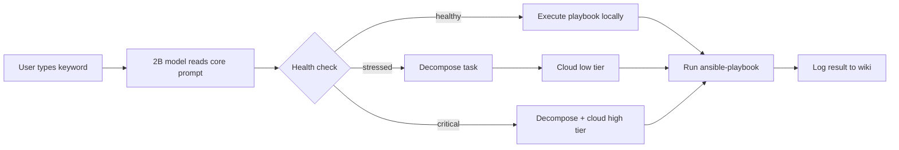
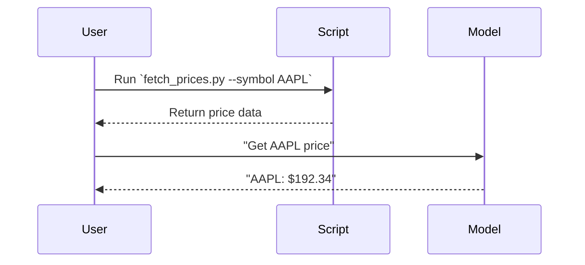
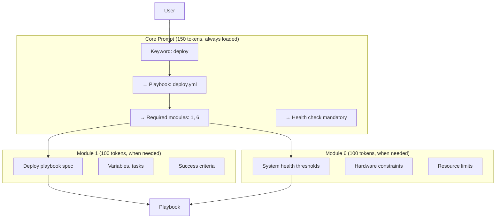
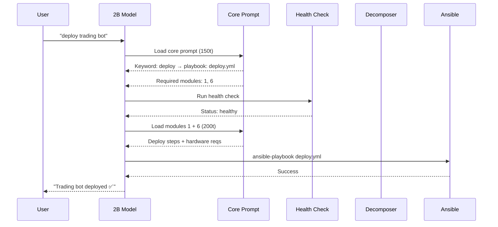
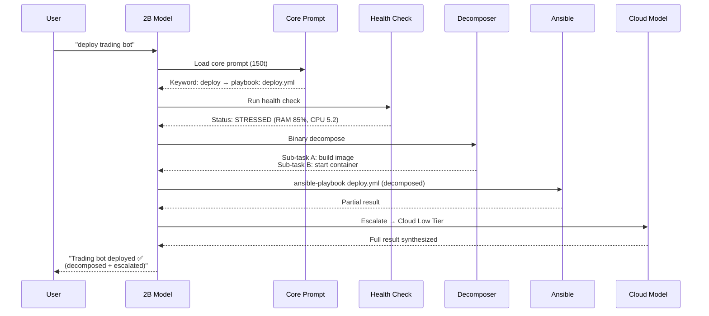

# Master Prompt System — Training Guide

**Level:** Beginner to Intermediate  
**Prerequisites:** Basic familiarity with Ansible, YAML, and the 2B model architecture  
**Time:** 30 minutes to first working prompt  
**Status:** Based on TI-032 v1.0 (2026-05-05)

---

## 1. System Foundation

### 1.1 What Is It?

The **Master Prompt System** turns keyword-matching into Ansible playbook execution. A 2-billion parameter model (qwen3.5:4b, gemma4:e4b, Phi-3) reads 150 tokens and knows exactly which playbook to trigger.



The key insight: **Don't make small models think — make them trigger.**

### 1.2 How Big Are the Prompts?

| Piece | Size | When Loaded |
|-------|------|-------------|
| Core prompt | ~150 tokens | Always |
| Module 1: Purpose | ~100 tokens | When keyword matches |
| Module 2: Dependencies | ~100 tokens | When keyword matches |
| Module 3: Data Sources | ~100 tokens | When keyword matches |
| Module 4: Conditions | ~100 tokens | When keyword matches |
| Module 5: Performance | ~100 tokens | When keyword matches |
| Module 6: Hardware | ~100 tokens | When keyword matches |
| **Maximum** | **~650 tokens** | **Full playbook + all modules** |

Compare to non-modular prompts: 2,000+ tokens → 67% smaller.

---

## 2. Installation

### 2.1 Quick Install (New Project)

Copy these files from the TI-032 project into your new project:

```bash
# 1. Create directory structure
mkdir -p new-project/{prompts,playbooks,scripts,wiki}

# 2. Copy core files
cp technical-infrastructure/prompts/core-prompt.md \
   new-project/prompts/
cp technical-infrastructure/prompts/module-*.md \
   new-project/prompts/

# 3. Copy scripts
cp technical-infrastructure/scripts/orchestrator_health.py \
   new-project/scripts/
cp technical-infrastructure/scripts/health_aware_executor.py \
   new-project/scripts/
cp technical-infrastructure/scripts/binary_decompose.py \
   new-project/scripts/

# 4. Copy playbooks
cp technical-infrastructure/ansible/playbooks/playbook-index.json \
   new-project/playbooks/
cp technical-infrastructure/ansible/playbooks/template.yml \
   new-project/playbooks/

# 5. Copy verification script
cp technical-infrastructure/scripts/verify-master-prompt.py \
   new-project/scripts/
```

### 2.2 Customize for Your Domain

Edit `new-project/prompts/core-prompt.md`:

```yaml
# Change these lines only:
domain: "YOUR_DOMAIN_HERE"          # e.g. "bookkeeping"
ansible_playbooks_role: "your_role"  # e.g. "bookkeeper"
ansible_project_name: "your_project" # e.g. "trading-books"
ansible_project_root: "/path/to/project"

# Add your keywords
keyword_triggers:
  inventory: "module-3-data-sources"
  reconcile: "module-4-conditions"
  price_check: "module-6-hardware"
```

### 2.3 Verify Installation

```bash
python3 new-project/scripts/verify-master-prompt.py
```

Expected output:
```
✅ Core prompt found
✅ 6 module files found
✅ Playbook-index.json valid
✅ All keyword triggers resolve to existing modules
✅ All Ansible references use role-based playbooks
✅ All module files under 150 tokens

VALIDATION PASSED
```

---

## 3. Your First Prompt

### 3.1 The Scenario

You're building a **bookkeeping system**. Users type keywords like:
- `"reconcile trades"` → reconcile trading transactions
- `"price check"` → fetch current market prices
- `"import CSV"` → convert CSV to Beancount

### 3.2 Step 1: List Your Keywords

Create a keyword inventory:

| Keyword | Playbook | Module |
|-----------|----------|--------|
| reconcile | `reconcile_transactions.yml` | Purpose + Conditions |
| price_check | `fetch_prices.yml` | Hardware |
| import_csv | `csv_to_beancount.yml` | Data Sources |
| ledger_size | `check_ledger_size.yml` | Performance |

### 3.3 Step 2: Write Your Playbook (Minimal)

```yaml
# playbooks/reconcile_transactions.yml
- name: Reconcile trading transactions
  hosts: localhost
  gather_facts: no
  vars:
    trigger_keywords:
      - reconcile           # Primary keyword
      - reconcile_trades    # Secondary keyword
      - match_transactions  # Tertiary keyword
    module_refs:
      - "../prompts/module-1-purpose.md"
      - "../prompts/module-4-conditions.md"
    target_file: "/path/to/transactions.beancount"
    price_source: "yahoo_finance"
    
  tasks:
    - name: Read transactions
      command: cat {{ target_file }}
      register: ledger_content
      changed_when: false
    
    - name: Extract unmatched transactions
      shell: grep -c "!" {{ target_file }} || true
      register: unmatched_count
      changed_when: false
    
    - name: Reconcile with price data
      debug:
        msg: "Reconciling {{ unmatched_count.stdout }} unmatched transactions using {{ price_source }}"
    
    - name: Run Beancount check
      command: bean-check {{ target_file }}
      register: check_result
      changed_when: false
      
    - name: Report status
      debug:
        msg: |
          Reconciliation complete: {{ check_result.rc == 0 | ternary('VALID', 'ERRORS FOUND') }}
          Unmatched transactions: {{ unmatched_count.stdout }}
```

### 3.4 Step 3: Register Keywords

Add to `prompts/core-prompt.md`:

```yaml
keyword_triggers:
  # Existing system triggers
  deploy: "module-1-purpose"
  check_health: "module-6-hardware"
  
  # YOUR NEW TRIGGERS
  reconcile: "module-1-purpose"          # Uses purpose + conditions
  price_check: "module-6-hardware"       # Uses hardware + data sources
  import_csv: "module-3-data-sources"    # Uses data sources only
  ledger_size: "module-5-performance"    # Uses performance only
  
# Add playbook mapping
playbook_mapping:
  reconcile: "reconcile_transactions.yml"
  price_check: "fetch_prices.yml"
  import_csv: "csv_to_beancount.yml"
  ledger_size: "check_ledger_size.yml"
```

### 3.5 Step 4: Add Module References

Edit `prompts/module-1-purpose.md` to add bookkeeping-specific language:

```markdown
## When keyword = "reconcile"

You are triggering `reconcile_transactions.yml` for Beancount bookkeeping.

### Input
- `target_file`: Beancount ledger file path
- `price_source`: yahoo_finance | bloomberg | alpha_vantage
- `unmatched`: Count of transactions with `!` status

### Action
1. Read target_file into memory
2. Extract unmatched transactions (status = `!`)
3. Fetch prices from price_source for unmatched dates
4. Update postings with reconciled prices
5. Run `bean-check` to validate

### Success Criteria
- `bean-check` exits 0 (no errors)
- All transactions matched to prices
```

That module file replaces 500+ tokens of playbook-specific instruction. The model only loads it when "reconcile" appears in the prompt.

## When to Use Playbooks vs Scripts

### Example: `fetch_prices.py` vs `fetch_prices.yml` for Price Data

| Feature | Script (`fetch_prices.py`) | Playbook (`fetch_prices.yml`) |
|--------|---------------------------|-----------------------------|
| Tokens | ~50 (lightweight) | ~200 (modular, reusable) |
| Orchestration | Manual task sequencing | Automated workflow | 
| Error Handling | Script-level | Playbook-level | 
| Retry Logic | Custom code | Playbook-defined | 
| Idempotency | Requires explicit checks | Built-in idempotency | 
| Model Work | Minimal | Modular | 
| Maintenance | Script-specific | Reusable across tasks | 

### Recommendations

* Use **playbooks** for:
  - Multi-step workflows
  - Idempotent operations
  - Reusable task sequences
  - Complex orchestration

* Use **scripts** for:
  - Single-step operations
  - Lightweight tasks
  - Quick ad-hoc executions

### Script Registration Example

Add to `core-prompt.md`:

```yaml
script_mapping:
  fetch_prices: "scripts/fetch_prices.py"
  fetch_prices_playbook: "playbooks/fetch_prices.yml"
```

## Creating a Script-Based Prompt

### Example: `fetch_prices.py` Script

```python
import requests
import argparse

parser = argparse.ArgumentParser()
parser.add_argument("--symbol", required=True, help="Stock symbol")
args = parser.parse_args()

url = f"https://api.example.com/price?symbol={args.symbol}"
response = requests.get(url)

if response.status_code == 200:
    print(f"Price: {response.json()['price']}")
else:
    print(f"Error {response.status_code}: {response.text}")
```

### Mermaid Sequence Diagram



### Script Execution Flow

1. User requests price data
2. Script is executed with arguments
3. Script communicates with API
4. Result is returned to user
5. Model can synthesize results if needed

### Best Practices

- Keep scripts focused on single tasks
- Use argparse for command-line arguments
- Implement error handling in scripts
- Register scripts in `core-prompt.md`
- Use scripts for lightweight, one-off tasks
- Use playbooks for complex, reusable workflows


---

## 4. Decomposing an Existing Prompt

### 4.1 The Original (Anti-Pattern)

Here's a typical 2,000-token prompt for deploying a trading bot:

```text
You are a deployment assistant. When the user asks to deploy a trading application:

1. Check the system health using /usr/local/bin/health_check.py. The script checks RAM, CPU, and disk usage. For RAM, use the psutil library (pip install psutil) and read /proc/meminfo on Linux or call sysctl on macOS. The threshold for healthy is 80% RAM, 4.0 load average CPU, and no swap usage (swap means the system is under memory pressure and will slow down significantly, so if swap_used > 0 then mark as critical).

2. If the system is healthy (RAM < 80%, CPU < 4.0, swap = 0), run the Ansible playbook at /path/to/playbooks/deploy.yml. The playbook requires... [500 more tokens of playbook explanation] ...

3. If the system is stressed (RAM 80-92%, CPU 4.0-6.0), binary decompose the task using the decomposer at /scripts/binary_decompose.py. The decomposer splits tasks into two equal chunks... [400 more tokens on decomposition mechanics] ...

4. If the system is critical (RAM > 92%, CPU > 6.0, swap > 0), escalate to cloud using cloud_escalation.py. The escalation tiers are... [600 more tokens on tiers, costs, retry logic] ...

5. After execution, always log results to /wiki/operational/sessions/health-decisions.jsonl. The JSONL format is... [300 more tokens] ...
```

**Token count:** ~2,200. **Problem:** Model must reason about all conditions, thresholds, and paths on every single prompt, even for a simple "deploy app" request.

### 4.2 The Decomposed Version



**Core prompt (extract):**

```yaml
# Core Prompt for Trading Bot Deployment
# Size: 150 tokens
# Always loaded

Trigger keywords:
  - deploy app
  - deploy trading_bot
  - deploy bot

Target playbook: deploy_trading_bot.yml

Required modules:
  - module-1-purpose (what this playbook does)
  - module-6-hardware (resource requirements)

Health check: REQUIRED (runs before every execution)
Command: python3 scripts/orchestrator_health.py --json
```

**Module 1 — Purpose (100 tokens):**

```markdown
## Playbook: deploy_trading_bot.yml

Deploys the trading bot container to Docker.

### Steps
1. Build Docker image from ./Dockerfile
2. Start container with `docker-compose up -d`
3. Verify health endpoint at localhost:8080/health
4. If health check fails, roll back to previous image

### Variables
- `bot_version`: Docker image tag (default: latest)
- `trading_mode`: paper | live
- `exchanges`: List of exchange APIs to enable
```

**Module 6 — Hardware (100 tokens):**

```markdown
## Hardware Requirements

### Minimum Resources
- RAM: 8 GB
- Disk: 50 GB SSD
- CPU: 4 cores

### Health Thresholds
- Healthy: RAM < 80%, CPU < 4.0, swap = 0
- Stressed: RAM 80-92%, CPU 4.0-6.0, any swap
- Critical: RAM > 92%, CPU > 6.0, swap > 0

### Deployment Constraints
- Docker daemon must be running
- Port 8080 must be free
- Trading API keys in /etc/secrets/
```

**Token savings:** 2,200 → 350 (84% reduction).

### 4.3 Decomposition Walkthrough

#### Step 1: Identify the keywords

In the original 2,200-token prompt, the actual trigger is buried. Extract it:

| Original Text | Keyword |
|---------------|---------|
| "deploy a trading application" | `deploy app` |
| "deploy a trading bot" | `deploy bot` |
| "deploy trading_bot" | `deploy bot` |

#### Step 2: Extract the playbook specification

Original has 500 tokens on playbook steps. Extract into module:

```markdown
# Before (in core prompt): 500 tokens
"1. Build Docker image from ./Dockerfile. Use docker build -t trading-bot:${VERSION} ..."

# After (in module-1-purpose): 50 tokens
"Build Docker image → compose up → verify health → rollback if needed"
```

#### Step 3: Extract health check thresholds

Original has 400 tokens on RAM/CPU/swap logic. Extract into module:

```markdown
# Before (in core prompt): 400 tokens
"If the system is healthy (RAM < 80%, CPU < 4.0, swap = 0), run the playbook..."

# After (in module-6-hardware): 50 tokens
"Health thresholds: healthy < 80% RAM, stressed 80-92%, critical > 92%"
```

#### Step 4: Extract escalation logic

Original has 600 tokens on cloud tiers. Extract into module or script:

```markdown
# Before (in core prompt): 600 tokens
"Escalation tiers: low (qwen3.5:397b, $0.011/1K)..."

# After: Removed from prompt entirely
# Script orchestrates: scripts/cloud_escalation.py
```

#### Step 5: Verify token counts

```bash
python3 scripts/verify-master-prompt.py --token-count
```

Expected:
```
Core prompt: 148 tokens ✅ (target < 150)
Module 1: 97 tokens ✅ (target < 150)
Module 6: 102 tokens ✅ (target < 150)
Total (if all loaded): 347 tokens ✅ (target < 650)
Original prompt: 2,147 tokens ❌
Savings: 1,800 tokens (84% reduction)
```

---

## 5. The Complete Flow





---

## 6. Common Patterns

### 6.1 Pattern: "Just give me the command"

For simple prompts where the user knows exactly what they want:

| User Input | System Loads | Action |
|------------|--------------|--------|
| `"deploy bot"` | Core prompt (150t) | Direct playbook execution |
| `"check health"` | Core prompt (150t) + Module 6 (100t) | Health monitoring only |
| `"what does X do?"` | Core prompt (150t) + Module 1 (100t) | Explain playbook purpose |

### 6.2 Pattern: "I need help figuring this out"

For exploratory prompts where the user doesn't know the exact keyword:

| User Input | System Response |
|------------|-----------------|
| `"I want to back up my data somewhere"` | "Did you mean: `backup_data` (local backup), `archive_logs` (long-term storage), or `sync_cloud` (cloud sync)?" |
| `"The bot seems slow"` | "Let me check system health... [runs health check]. CPU at 5.3 — system is stressed. I recommend: (1) defer non-critical tasks, (2) decompose current task, or (3) escalate to cloud." |

### 6.3 Pattern: "Do this complex thing"

For complex multi-step operations:

| User Input | System Response |
|------------|-----------------|
| `"set up the entire trading pipeline from scratch including price feeds, ledger, and reporting"` | Decomposes into: 1) configure price feeds, 2) initialize Beancount ledger, 3) set up daily reporting cron job. Execute sub-tasks sequentially. |

---

## 7. Troubleshooting

### Problem: Model doesn't trigger playbook

```
User: "deploy bot"
Model: "I can help you deploy a bot... [long explanation, no ansible-playbook call]"
```

**Fix:** Verify the keyword is in `playbook-index.json`:

```json
{
  "playbook-name": "deploy",
  "trigger_keyword": "deploy"
}
```

### Problem: Module not found

```
Error: Module file '../prompts/module-3-data-sources.md' not found
```

**Fix:** Check module numbering. Must be `module-3-data-sources.md`, not `module-3-data.md`.

### Problem: Token count too high

```
Core prompt: 1,847 tokens ❌ (target < 150)
```

**Fix:** Move verbose descriptions into modules. Core prompt should only have:
- Keyword triggers (list)
- Module paths (list)
- Health check command (1 line)

### Problem: Health check blocks execution

```
Error: Health check returned critical — playbook not executed
```

**This is not a bug.** This is the system working correctly. If health is critical, the system refuses to add load. Options:
1. Free up resources
2. Use `--force` (not recommended)
3. Escalate to cloud tier

---

## 8. Reference Card

```
KEYWORD: deploy app
  ├── Core prompt (150t — always loaded)
  ├── Module 1: Purpose (100t) — what the playbook does
  ├── Module 6: Hardware (100t) — resource requirements
  └── Total: 350 tokens

KEYWORD: check health
  ├── Core prompt (150t)
  ├── Module 6: Hardware (100t) — health thresholds
  └── Total: 250 tokens

KEYWORD: unknown command
  ├── Core prompt (150t)
  └── Response: "Available keywords: deploy, check_health, backup..."

HEALTHY: Execute playbook locally
STRESSED: Decompose + Cloud Low ($0.011/1K)
CRITICAL: Decompose + Cloud High ($0.055/1K)
```

---

## 9. Resources

| Document | Purpose |
|----------|---------|
| [Master Prompt Guide](master-prompt-guide) | Complete user documentation |
| [Quick Start](master-prompt-quickstart) | 5-minute activation |
| [Architecture](master-prompt-architecture) | Design decisions |
| [Research Sources](operational/planning/RESEARCH-CITATIONS-MASTER-PROMPT) | Evidence base (47 sources) |
| [Benchmarking](performance-benchmarking) | Performance measurements |
| [Playbook Index](/technical-infrastructure/ansible/playbooks/playbook-index.json) | Keyword → Playbook mapping |
| [Core Prompt](/technical-infrastructure/prompts/core-prompt) | The always-loaded 150-token prompt |
| [Health Check Guide](/technical-infrastructure/technical-infrastructure/health-check-integration) | Integrating TI-031 |
| [Decomposition Doc](/technical-infrastructure/technical-infrastructure/binary-decomposition) | Task splitting mechanics |
| [Escalation Doc](/technical-infrastructure/technical-infrastructure/cloud-escalation) | Cloud tier routing |

---

**Happy prompting!**

*Revision: TI-032 v1.0 | 2026-05-05*
