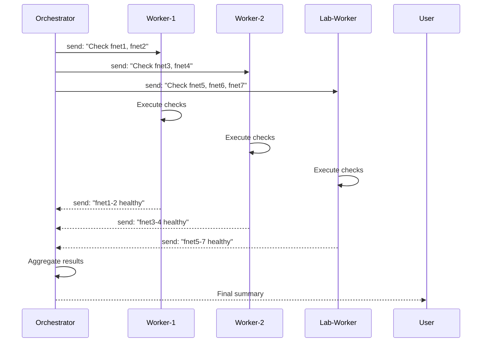
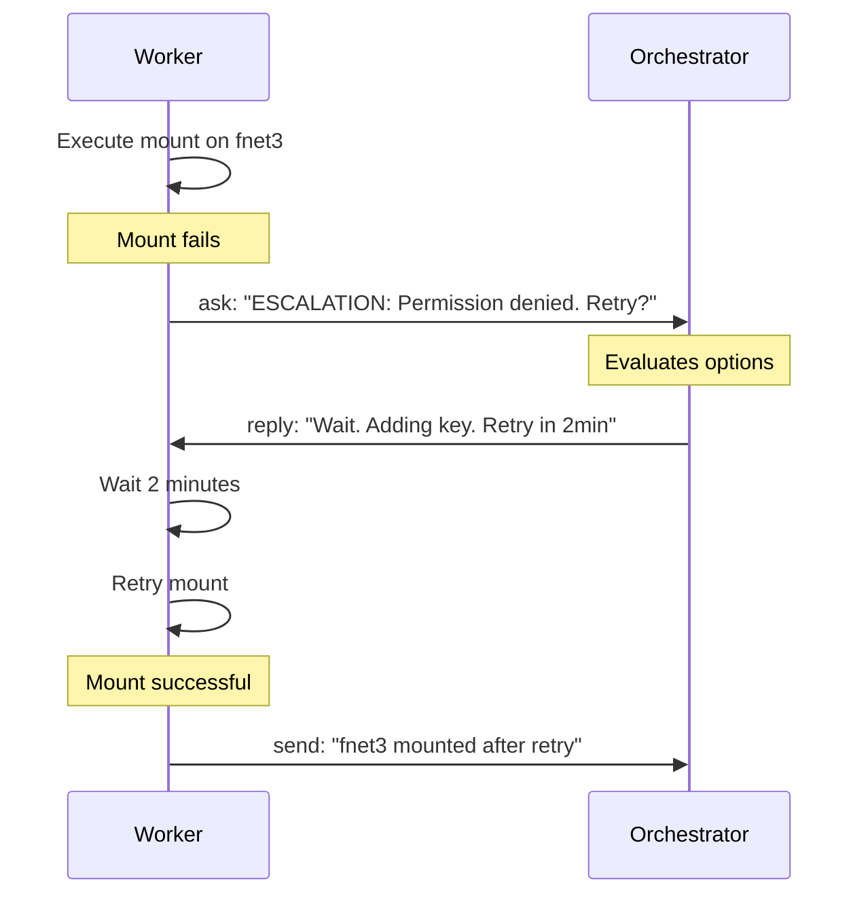

# Intercom Coordination Workflows — Architecture

---

## Executive Summary

Intercom Coordination Workflows enable **multi-agent orchestration** using pi-intercom for communication between sessions on the same machine. This architecture supports **tiered model deployment** where high-cloud orchestrators coordinate fleets of medium-cloud and low-cloud workers managing lab node operations.

**Key Benefits:**
- 🎯 **Cost Optimization:** 70-80% savings vs. all-high-cloud approach
- 🔄 **Parallel Execution:** Multiple workers operate concurrently
- ⚡ **Exception Handling:** Structured escalation paths via intercom.ask
- 📊 **Centralized Oversight:** Orchestrator maintains global state
- 🔗 **SSHFS Integration:** Direct integration with sshfs-accessible for lab operations

---

## Architecture Overview

### System Topology

```
┌─────────────────────────────────────────────────────────────────────────┐
│                         SAME MACHINE (Orchestrator Host)                │
│                                                                         │
│  ┌───────────────────────────────────────────────────────────────────┐ │
│  │                     Orchestrator Session                          │ │
│  │                     High Cloud Model                              │ │
│  │              (qwen3.5:397b-cloud / kimi-k2.6)                     │ │
│  │                                                                   │ │
│  │  • Strategic planning & decomposition                             │ │
│  │  • Worker assignment & load balancing                             │ │
│  │  • Exception handling & escalation decisions                      │ │
│  │  • Result aggregation & reporting                                 │ │
│  └───────────────────────────────────────────────────────────────────┘ │
│                              │                                          │
│         ┌────────────────────┼────────────────────┐                    │
│         │                    │                    │                    │
│         ▼                    ▼                    ▼                    │
│  ┌──────────────┐    ┌──────────────┐    ┌──────────────┐            │
│  │  Worker 1    │    │  Worker 2    │    │  Worker 3    │            │
│  │  Session     │    │  Session     │    │  Session     │            │
│  │  Med Cloud   │    │  Low Cloud   │    │  Local       │            │
│  │  qwen3.5:4b  │    │  qwen3:8b    │    │  gemma4:e4b  │            │
│  │              │    │              │    │              │            │
│  │  • Analysis  │    │  • Simple    │    │  • Direct    │            │
│  │  • Monitoring│    │  • Status    │    │    hardware  │            │
│  │  • Data prep │    │  • Checks    │    │  • SSHFS ops │            │
│  └──────────────┘    └──────────────┘    └──────────────┘            │
└─────────────────────────────────────────────────────────────────────────┘
                                 │
                                 │ SSHFS (reverse mount)
                                 │
        ┌────────────────────────┼────────────────────────┐
        │                        │                        │
        ▼                        ▼                        ▼
┌──────────────┐        ┌──────────────┐        ┌──────────────┐
│   fnet1      │        │   fnet2      │        │   fnet3      │
│   (Ubuntu)   │        │   (Ubuntu)   │        │   (Ubuntu)   │
│              │        │              │        │              │
│  Mount:      │        │  Mount:      │        │  Mount:      │
│  /mnt/       │        │  /mnt/       │        │  /mnt/       │
│  trading-    │        │  trading-    │        │  trading-    │
│  desk/       │        │  desk/       │        │  desk/       │
└──────────────┘        └──────────────┘        └──────────────┘
        │                        │                        │
        └────────────────────────┼────────────────────────┘
                                 │
                        ┌────────┴────────┐
                        ▼                 ▼
                ┌──────────────┐  ┌──────────────┐
                │   fnet4      │  │   fnet5      │
                │   (Ubuntu)   │  │   (Ubuntu)   │
                └──────────────┘  └──────────────┘
                        │                 │
                        └────────┬────────┘
                                 │
                        ┌────────┴────────┐
                        ▼                 ▼
                ┌──────────────┐  ┌──────────────┐
                │   fnet6      │  │   fnet7      │
                │   (Ubuntu)   │  │   (Ubuntu)   │
                └──────────────┘  └──────────────┘
```

### Component Responsibilities

| Component | Model Tier | Responsibilities | Cost/Turn |
|-----------|------------|------------------|-----------|
| **Orchestrator** | High Cloud | Planning, decisions, exceptions, aggregation | ~$0.10-0.30 |
| **Worker (Medium)** | Medium Cloud | Analysis, monitoring, data preparation | ~$0.00-0.02 |
| **Worker (Low)** | Low Cloud | Simple tasks, status checks | ~$0.00 |
| **Worker (Local)** | Local | SSHFS ops, health checks, direct hardware access | ~$0.00 |

---

## Communication Patterns

### Pattern 1: Fire-and-Forget (intercom.send)

**Use Case:** Task assignment, progress updates, notifications

```
Orchestrator                    Worker
     │                             │
     │─── intercom.send ──────────►│
     │    "Task: Health check      │
     │     fnet1, fnet2"           │
     │                             │
     │                             │── Execute task
     │                             │
     │◄── intercom.send ───────────│
     │    "Complete. All healthy"  │
     │                             │
```

**Characteristics:**
- Non-blocking
- No timeout
- Sender continues immediately
- Receiver processes asynchronously

**When to Use:**
- Task assignment
- Progress updates
- Completion notifications
- Status reports

---

### Pattern 2: Blocking Clarification (intercom.ask / intercom.reply)

**Use Case:** Decisions, escalations, clarifications

```
Worker                        Orchestrator
   │                               │
   │─── intercom.ask ─────────────►│
   │    "ESCALATION: fnet3 mount   │
   │     failed. Retry or skip?"   │
   │                               │
   │                               │── Evaluate options
   │                               │── Make decision
   │                               │
   │◄── intercom.reply ────────────│
   │    "Retry once. If fails,     │
   │     skip and continue."       │
   │                               │
   │── Continue with decision ─────│
```

**Characteristics:**
- Blocking (worker waits)
- 10-minute timeout
- Orchestrator must respond
- Unblocks worker on reply

**When to Use:**
- Exception handling
- Ambiguity resolution
- Strategic decisions
- Recovery actions

---

### Pattern 3: Multi-Worker Broadcast

**Use Case:** Parallel task execution across multiple workers

```
                    Orchestrator
                        │
        ┌───────────────┼───────────────┐
        │               │               │
        ▼               ▼               ▼
   ┌─────────┐    ┌─────────┐    ┌─────────┐
   │ Worker 1│    │ Worker 2│    │ Worker 3│
   │         │    │         │    │         │
   │ Execute │    │ Execute │    │ Execute │
   └─────────┘    └─────────┘    └─────────┘
        │               │               │
        └───────────────┼───────────────┘
                        │
                        ▼
                  Aggregation
```

**Characteristics:**
- Parallel execution
- Synchronized deadlines
- Centralized aggregation
- Straggler handling

**When to Use:**
- Fleet-wide health checks
- Parallel monitoring
- Distributed data collection
- Load-balanced operations

---

### Pattern 4: Planner-Executor Pipeline

**Use Case:** Multi-phase operations with sequential dependencies

```
Planner                       Executor
   │                              │
   │── Plan (attachment) ────────►│
   │   Phases: 1,2,3,4,5          │
   │                              │
   │                              │── Phase 1
   │◄── Phase 1 complete ─────────│
   │                              │
   │                              │── Phase 2
   │◄── Phase 2 complete ─────────│
   │                              │
   │                              │── Phase 3 (ESCALATION)
   │◄── intercom.ask ─────────────│
   │   "Phase 3 failed. Retry?"   │
   │                              │
   │── Reply: "Retry once" ──────►│
   │                              │
   │                              │── Phase 3 retry
   │◄── Phase 3 complete ─────────│
   │                              │
   │                              │── Phases 4, 5
   │◄── Final report ─────────────│
```

**Characteristics:**
- Sequential phases
- Phase-by-phase reporting
- Escalation support
- Audit trail

**When to Use:**
- SSHFS deployments
- Multi-step installations
- Coordinated rollouts
- Complex operations

---

## Message Flow Examples

### Example 1: Fleet Health Check



### Example 2: Exception Escalation



---

## Model Tier Strategy

### High Cloud (Orchestrator)

**Models:**
- `ollama/qwen3.5:397b`
- `ollama/kimi-k2.6`
- `ollama/deepseek-v4-pro`

**Capabilities:**
- Complex reasoning
- Strategic planning
- Multi-factor decision making
- Pattern recognition
- Exception handling

**Responsibilities:**
```markdown
1. Receive user tasks
2. Decompose into worker assignments
3. Assign workers based on capability
4. Monitor progress via intercom
5. Handle escalations (intercom.ask responses)
6. Aggregate worker results
7. Produce final summary
```

**Cost:** ~$0.10-0.30 per turn  
**Use When:** Complex decisions, planning, exception handling

---

### Medium Cloud (Workers)

**Models:**
- `ollama/qwen3.5:4b`
- `ollama/gemma4:e4b`

**Capabilities:**
- Standard analysis
- Data processing
- Monitoring tasks
- Multi-step execution

**Responsibilities:**
```markdown
1. Receive task assignments
2. Execute autonomously
3. Report progress every 2 minutes
4. Escalate exceptions via ask
5. Deliver results on deadline
```

**Cost:** ~$0.00-0.02 per turn  
**Use When:** Analysis, monitoring, data preparation

---

### Low Cloud / Local (Workers)

**Models:**
- `ollama/qwen3:8b`
- `ollama/qwen3.5:1.5b`
- `ollama/gemma4:e4b`

**Capabilities:**
- Simple monitoring
- Status checks
- Direct hardware access
- SSHFS operations

**Responsibilities:**
```markdown
1. Receive simple task assignments
2. Execute with minimal reasoning
3. Report completion
4. Escalate on failure
```

**Cost:** ~$0.00 per turn  
**Use When:** Simple checks, SSHFS ops, health monitoring

---

## Cost Analysis

### Scenario: Fleet-Wide Health Check (7 Nodes)

#### All High-Cloud Approach

```
Orchestrator (planning):     $0.10
Worker 1 (fnet1-2):          $0.15 × 2 nodes = $0.30
Worker 2 (fnet3-4):          $0.15 × 2 nodes = $0.30
Worker 3 (fnet5-7):          $0.15 × 3 nodes = $0.45
Aggregation:                 $0.10
─────────────────────────────────────
Total:                       $1.25
```

#### Intercom-Coordinated Mixed-Tier

```
Orchestrator (high cloud):   $0.10
Worker 1 (medium cloud):     $0.02
Worker 2 (low cloud):        $0.00
Worker 3 (local):            $0.00
Verification:                $0.02
─────────────────────────────────────
Total:                       $0.14

Savings: $1.25 - $0.14 = $1.11 (89% savings)
```

### Cost Comparison Table

| Approach | Cost | Savings |
|----------|------|---------|
| All High-Cloud | $1.25 | — |
| All Medium-Cloud | $0.35 | 72% |
| Mixed-Tier with Intercom | $0.14 | 89% |
| All Local (when possible) | $0.02 | 98% |

---

## Integration with SSHFS

### Architecture

```
┌──────────────────────────────────────────────────────────────┐
│                    Orchestrator Session                      │
│              (mac-orchestrator: macOS)                       │
│                                                              │
│  Workspace: /Users/friasc/Dropbox/workshop       │
│                                                              │
│  ┌────────────────────────────────────────────────────────┐ │
│  │              intercom-coord-workflows                  │ │
│  │              + sshfs-accessible                        │ │
│  └────────────────────────────────────────────────────────┘ │
└──────────────────────────────────────────────────────────────┘
                            │
                            │ SSH (reverse)
                            │
        ┌───────────────────┼───────────────────┐
        │                   │                   │
        ▼                   ▼                   ▼
┌──────────────┐   ┌──────────────┐   ┌──────────────┐
│   fnet1      │   │   fnet2      │   │   fnet3      │
│   (Ubuntu)   │   │   (Ubuntu)   │   │   (Ubuntu)   │
│              │   │              │   │              │
│  SSHFS mount │   │  SSHFS mount │   │  SSHFS mount │
│  backwards   │   │  backwards   │   │  backwards   │
│  to orchestr │   │  to orchestr │   │  to orchestr │
│              │   │              │   │              │
│  /mnt/       │   │  /mnt/       │   │  /mnt/       │
│  trading-    │   │  trading-    │   │  trading-    │
│  desk/       │   │  desk/       │   │  desk/       │
└──────────────┘   └──────────────┘   └──────────────┘
```

### Workflow

```bash
# 1. Orchestrator coordinates via intercom
/chain planner-executor "Deploy SSHFS mounts on all lab nodes"

# 2. Workers execute sshfs-accessible scripts
./scripts/mount-all.sh fnet1 fnet2 fnet3

# 3. Workers report status via intercom
intercom.send("orchestrator", "Mount complete on fnet1-3")

# 4. Orchestrator verifies all mounts
./scripts/verify-mounts.sh --json

# 5. Final report
intercom.send("orchestrator", "All 7 nodes mounted and verified")
```

### Error Scenarios

| Error | Cause | Recovery |
|-------|-------|----------|
| "Permission denied (publickey)" | SSH key not in authorized_keys | Add key, retry |
| "Connection reset by peer" | Host key not trusted | ssh-keyscan, add to known_hosts |
| "bad mount point" | Mount point doesn't exist | Create with sudo |
| "fuse: unknown option" | SSHFS version mismatch | Use compatible flags |

---

## Session Management

### Session Naming Convention

```bash
# Orchestrator
/name orchestrator

# Workers (by capability)
/name worker-medium-1    # qwen3.5:4b
/name worker-medium-2    # qwen3.5:4b
/name worker-low-1       # qwen3:8b
/name worker-low-2       # qwen3:8b
/name worker-local-1     # gemma4:e4b
/name worker-local-2     # gemma4:e4b

# Specialized workers
/name lab-monitor        # Health checks
/name sshfs-worker       # SSHFS operations
/name data-collector     # Data gathering
```

### Session Discovery

```bash
# List all active sessions
intercom({ action: "list" })

# Expected output:
# orchestrator - active
# worker-medium-1 - active
# worker-medium-2 - active
# worker-low-1 - active
# worker-low-2 - active
# worker-local-1 - active
# worker-local-2 - active
# lab-monitor - active
# sshfs-worker - active
```

### Session Lifecycle

```
Start Session → Name Session → Enable Intercom → Execute Tasks → End Session
     │              │               │                │              │
     ▼              ▼               ▼                ▼              ▼
  pi command    /name          Automatic      intercom.send   Exit or
  with model   command       on pi startup   /ask/reply     timeout
```

---

## Error Handling

### Escalation Hierarchy

```
Worker detects issue
       │
       ▼
Attempt local recovery (if simple)
       │
       ▼
Still failing?
       │
       ├─ No ──► Continue execution
       │
       ▼ Yes
Escalate via intercom.ask
       │
       ▼
Orchestrator evaluates
       │
       ├─ Simple ──► Reply immediately
       │
       ├─ Complex ──► Consult logs/history
       │
       └─ Critical ──► Escalate to human
       │
       ▼
Worker implements decision
       │
       ▼
Report outcome
```

### Timeout Management

| Timeout Type | Duration | Action |
|--------------|----------|--------|
| intercom.ask | 10 minutes | Ask fails, worker must handle timeout |
| Task deadline | Configurable | Worker requests extension or delivers partial |
| Progress update | 2 minutes (for long tasks) | Orchestrator checks in if silent |
| Worker response | 5 minutes (after deadline) | Orchestrator marks worker offline |

### Recovery Strategies

```typescript
// Worker: Retry with exponential backoff
async function retryWithBackoff(operation, maxRetries = 3) {
  for (let i = 0; i < maxRetries; i++) {
    try {
      return await operation();
    } catch (error) {
      if (i === maxRetries - 1) throw error;
      await sleep(Math.pow(2, i) * 1000); // 1s, 2s, 4s
    }
  }
}

// Orchestrator: Reassign task on worker failure
async function reassignTask(failedWorker, newWorker, task) {
  await intercom.send(newWorker, `
    Reassigned task from ${failedWorker}:
    ${task}
    Original worker failed. Proceed with caution.
  `);
}
```

---

## Best Practices

### Orchestrator Best Practices

1. **Set Clear Expectations**
   ```typescript
   intercom.send("worker-1", `
     Task: Health check fnet1, fnet2
     Deadline: 5 minutes
     Report: intercom.send when complete
     Escalate: intercom.ask if any check fails
     Progress: Update every 2 minutes if task exceeds 5 minutes
   `);
   ```

2. **Monitor Proactively**
   ```typescript
   setInterval(async () => {
     const pending = await intercom.pending();
     if (pending.length > 0) {
       console.log(`⚠️ ${pending.length} workers waiting`);
       // Handle escalations immediately
     }
   }, 30000);
   ```

3. **Balance Workload**
   ```typescript
   // Assign based on worker capability
   const assignments = {
     "worker-medium-1": ["fnet1", "fnet2"],  // Analysis tasks
     "worker-low-1": ["fnet3", "fnet4"],     // Simple checks
     "worker-local-1": ["fnet5", "fnet6", "fnet7"]  // SSHFS ops
   };
   ```

### Worker Best Practices

1. **Acknowledge Immediately**
   ```typescript
   await intercom.send("orchestrator", 
     "Task received. Starting now. ETA: 5 minutes.");
   ```

2. **Send Progress Updates**
   ```typescript
   setInterval(async () => {
     await intercom.send("orchestrator", `
       Progress: ${completed}/${total}
       Current: ${currentNode}
       Status: ${status}
     `);
   }, 120000);
   ```

3. **Escalate Early**
   ```typescript
   if (error.severity === "high") {
     await intercom.ask("orchestrator", `
       ESCALATION: ${error.message}
       Impact: ${impact}
       Options: (A) ..., (B) ..., (C) ...
       Recommendation: ${suggestion}
     `);
   }
   ```

---

## Troubleshooting

### Common Issues

| Issue | Symptoms | Solution |
|-------|----------|----------|
| Session not found | `intercom.send` returns `delivered: false` | Verify target session ran `/name` command |
| Ask timeout | Worker waits >10 minutes | Use `send` for non-blocking updates |
| Message not delivered | Target doesn't respond | Check `intercom.list()` shows target |
| Multiple pending asks | Orchestrator overwhelmed | Prioritize critical escalations |
| Worker disconnected | Task incomplete | Reassign to another worker |

### Debug Commands

```bash
# Check session connectivity
intercom({ action: "list" })

# Check pending asks
intercom({ action: "pending" })

# Check connection status
intercom({ action: "status" })

# Test message delivery
intercom({ action: "send", to: "worker-1", message: "Test" })
```

---

## Performance Optimization

### Parallelization Strategies

1. **Horizontal Scaling**
   - Add more worker sessions
   - Distribute nodes evenly
   - Use broadcast pattern

2. **Pipeline Parallelism**
   - Overlap phases where possible
   - Start Phase 2 on completed nodes while Phase 1 continues on others

3. **Load Balancing**
   - Assign based on worker capacity
   - Monitor worker utilization
   - Rebalance dynamically

### Latency Reduction

| Optimization | Impact | Implementation |
|--------------|--------|----------------|
| Local workers | 90%+ cost reduction | Use `gemma4:e4b` for simple tasks |
| Parallel execution | 3-7× speedup | Broadcast to multiple workers |
| Progress updates | Earlier issue detection | 2-minute checkpoints |
| Exception escalation | Faster recovery | Immediate `intercom.ask` on failure |

---

## Security Considerations

### SSH Key Management

```bash
# Distribute keys securely
for node in fnet1 fnet2 fnet3 fnet4 fnet5 fnet6 fnet7; do
  ssh $node "cat ~/.ssh/id_rsa.pub" >> ~/.ssh/authorized_keys
done

# Verify key distribution
for node in fnet1 fnet2 fnet3 fnet4 fnet5 fnet6 fnet7; do
  ssh $node "grep -c 'ssh-rsa' ~/.ssh/authorized_keys"
done
```

### Intercom Security

- **Same-machine only:** Intercom doesn't work across network
- **Session isolation:** Each session has independent context
- **No message encryption:** Messages stay on local machine
- **Access control:** Named sessions prevent accidental targeting

---

## Future Enhancements

### Planned Features

1. **Auto-scaling workers** — Dynamically spawn workers based on load
2. **Priority queues** — Prioritize critical tasks
3. **Worker health monitoring** — Detect and replace failing workers
4. **Result caching** — Cache frequent query results
5. **Cross-machine intercom** — Extend beyond same-machine constraint

### Experimental Features

1. **Model auto-selection** — Automatically route tasks to appropriate tier
2. **Cost tracking** — Real-time cost monitoring per worker
3. **Performance analytics** — Worker performance metrics
4. **Predictive scaling** — Anticipate load spikes

---

## References

- [Package README](../../packages/intercom-coord-workflows/README.md)
- [Skill Documentation](../../packages/intercom-coord-workflows/skills/intercom-coord-workflows/SKILL.md)
- [Coordinator Agent](../../packages/intercom-coord-workflows/agents/intercom-coordinator.md)
- [Worker Agent](../../packages/intercom-coord-workflows/agents/intercom-worker.md)
- [pi-intercom Skill](/usr/local/lib/node_modules/pi-intercom/skills/pi-intercom/SKILL.md)
- [SSHFS Accessible](../../packages/sshfs-accessible/skills/sshfs-accessible/SKILL.md)
- [Decompose-Execute-Verify](../../packages/decompose-execute-verify/README.md)

---

**Document Version:** 1.0.0  
**Last Updated:** 2026-05-14  
**Maintained By:** Trading Desk Team
