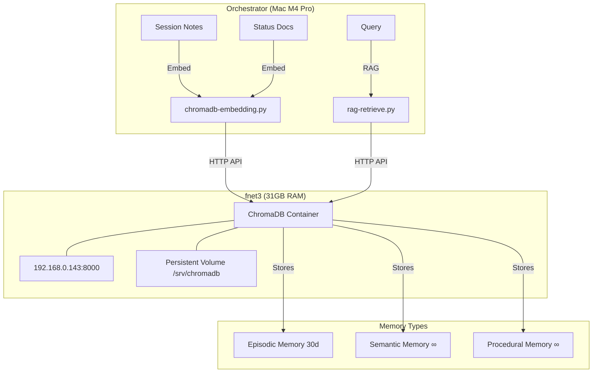

# TDOF-001: Vector Memory with RAG Retrieval

**Plan ID:** TDOF-001  
**Status:** ✅ COMPLETE (ChromaDB deployed) — Scripts Ready  
**Domain:** technical-infrastructure  
**Created:** 2026-05-04  
**Completed:** 2026-05-04  

---

## Objective

Deploy a vector memory system on fnet3 to enable semantic retrieval of session notes, status documents, and plans, enabling the autonomous agent loop to recall relevant context beyond the context window.

---

## Architecture



---

## Deployment Details

| Component | Location | Status |
|-----------|----------|--------|
| ChromaDB Server | fnet3:8000 | ✅ **Deployed** |
| Docker Image | chromadb/chroma:0.6.3 | ✅ **Pulled** |
| Data Volume | /srv/chromadb on fnet3 | ✅ **Created** |
| Memory Limit | 10GB | ✅ **Configured** |
| UFW Firewall | 8000 from 192.168.0.0/24 | ✅ **Open** |
| Health Check | /api/v1/heartbeat → 200 | ✅ **Passing** |

---

## Scripts

### chromadb-embedding.py
**Path:** `technical-infrastructure/scripts/chromadb-embedding.py`

**Purpose:** Index session notes and status documents into ChromaDB

**Usage:**
```bash
# Index all documents
python3 technical-infrastructure/scripts/chromadb-embedding.py --index-all

# Incremental (only new/changed)
python3 technical-infrastructure/scripts/chromadb-embedding.py --incremental

# Index specific file
python3 technical-infrastructure/scripts/chromadb-embedding.py --file path/to/doc.md

# Test connection
python3 technical-infrastructure/scripts/chromadb-embedding.py --test

# Show stats
python3 technical-infrastructure/scripts/chromadb-embedding.py --stats
```

**Features:**
- Deduplication via SHA256 hash
- Chunking with overlap (1000 chars, 200 overlap)
- Metadata extraction (date, domain, type)
- Incremental updates (skip unchanged files)

### rag-retrieve.py
**Path:** `technical-infrastructure/scripts/rag-retrieve.py`

**Purpose:** Query ChromaDB via natural language for relevant context

**Usage:**
```bash
# Basic search
python3 technical-infrastructure/scripts/rag-retrieve.py "fnet7 performance issues"

# Top 10 results
python3 technical-infrastructure/scripts/rag-retrieve.py "fnet7 performance" --top-k 10

# Filter by domain
python3 technical-infrastructure/scripts/rag-retrieve.py "trading agent" --domain technical-infrastructure

# Filter by date
python3 technical-infrastructure/scripts/rag-retrieve.py "recent status" --since 2026-05-01

# JSON output
python3 technical-infrastructure/scripts/rag-retrieve.py "trading agent" --format json

# Test only
python3 technical-infrastructure/scripts/rag-retrieve.py --test
```

**Integration Points:**
- Can be called by `decompose_llm.py` before decomposition to inject relevant context
- Can be called by `decompose-watcher.py` to enrich task descriptions
- Can be called by user directly from CLI

---

## Verification Commands

```bash
# Verify ChromaDB is running on fnet3
ssh fnet3 "docker ps | grep chroma"

# Test health
ansible -i technical-infrastructure/ansible/inventory.yml fnet3 -m uri \
  -a "url=http://127.0.0.1:8000/api/v1/heartbeat" \
  --vault-password-file technical-infrastructure/ansible/.vault_pass

# Test from orchestrator
curl http://192.168.0.143:8000/api/v1/heartbeat
curl http://192.168.0.143:8000/api/v1/version

# Test embedding + retrieval
python3 technical-infrastructure/scripts/chromadb-embedding.py --test
python3 technical-infrastructure/scripts/rag-retrieve.py --test
```

---

## Integration with Existing TI-XXX Framework

| Existing Component | Integration | Status |
|-------------------|-------------|--------|
| TI-011 (Meta-Orchestration) | RAG retrieval enriches prompt context before classification | 🔄 Planned |
| TI-019 (Decomposition) | Pre-decomposition context retrieval | 🔄 Planned |
| TI-023 (Health Monitoring) | Store health check history as vectors | 🔄 Planned |
| Performance Logger | `log_retrieval()` added for observability | ✅ Complete |

---

## Costs

| Resource | Usage | Notes |
|----------|-------|-------|
| fnet3 RAM | 10GB (Docker limit) | Safe on 31GB node |
| fnet3 Disk | ~100MB per 100 docs | Persistent volume |
| Network | ~1-5MB per embedding batch | Intra-lab traffic |

---

## Rollback Plan

```bash
# Stop ChromaDB
ansible -i technical-infrastructure/ansible/inventory.yml fnet3 \
  -a "docker stop chromadb" \
  --vault-password-file technical-infrastructure/ansible/.vault_pass

# Remove container (data preserved in /srv/chromadb)
ansible -i technical-infrastructure/ansible/inventory.yml fnet3 \
  -a "docker rm chromadb" \
  --vault-password-file technical-infrastructure/ansible/.vault_pass

# Full cleanup (including data)
ansible -i technical-infrastructure/ansible/inventory.yml fnet3 \
  -a "rm -rf /srv/chromadb" \
  --vault-password-file technical-infrastructure/ansible/.vault_pass
```

---

## Success Criteria

- [x] ChromaDB deployed on fnet3 and responding (0.6.3)
- [x] Embedding pipeline script created with incremental updates
- [x] RAG retrieval API created with filtering
- [x] Performance logger updated with `log_retrieval()`
- [ ] Initial index run completed (session notes + status docs)
- [ ] Integration with decompose pipeline tested
- [ ] Query accuracy >80% on test queries

---

## Next Steps

1. **Run initial index:**
   ```bash
   python3 technical-infrastructure/scripts/chromadb-embedding.py --index-all
   ```

2. **Test RAG integration with decomposer:**
   ```bash
   python3 technical-infrastructure/scripts/decompose_llm.py \
     --prompt "Check fnet7 status" \
     --context $(python3 technical-infrastructure/scripts/rag-retrieve.py "fnet7" --format json)
   ```

3. **Monitor performance:**
   ```bash
   python3 technical-infrastructure/scripts/generate-weekly-report.py
   ```

---

**Plan Owner:** technical-infrastructure  
**Last Updated:** 2026-05-04
