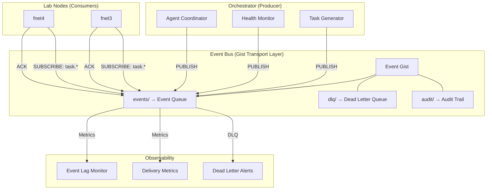
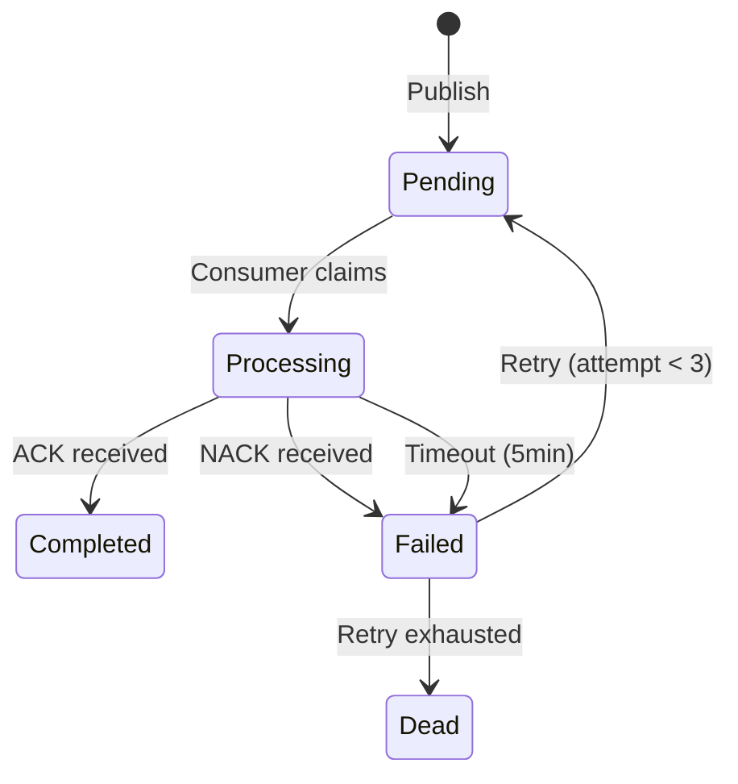

# PLAN: TI-010 — Event-Driven Gist Message Protocol

**Plan ID:** TI-010  
**Status:** ✅ **Architecture Complete** — Ready for Implementation  
**Domain:** technical-infrastructure (Off-Premises Orchestration)  
**Created:** 2026-05-04  
**Updated:** 2026-05-04  

---

## Summary

Redesign TI-010 from a **manual polling backup** to a **proper event-driven message bus** using the existing GitHub Gist transport layer. This enables real-time async communication between agents when VPN/lab connectivity is unavailable.

---

## Problem Statement

**Current TI-010 Limitations:**
- Workers poll every 30s via systemd timer (wasteful CPU/API usage)
- No pub/sub semantics — orchestrator manually reads/writes comments
- No queue semantics — lost messages if worker goes offline
- No event types — all messages treated identically
- No retry logic — failed tasks silently dropped
- No observability — no visibility into message flow

**Goal:** Convert Gist-based communication into a lightweight event-driven bus.

---

## Architecture



---

## Event Schema

### Event Types

```python
from enum import Enum

class EventType(Enum):
    # Task lifecycle
    TASK_CREATED = "task.created"
    TASK_ASSIGNED = "task.assigned"
    TASK_STARTED = "task.started"
    TASK_COMPLETED = "task.completed"
    TASK_FAILED = "task.failed"
    TASK_CANCELLED = "task.cancelled"
    
    # Node lifecycle
    NODE_ONLINE = "node.online"
    NODE_OFFLINE = "node.offline"
    NODE_HEALTH_CHECK = "node.health"
    
    # Model lifecycle
    MODEL_REQUEST = "model.request"
    MODEL_RESPONSE = "model.response"
    MODEL_ERROR = "model.error"
    
    # Agent lifecycle
    AGENT_REGISTERED = "agent.registered"
    AGENT_UNREGISTERED = "agent.unregistered"
    AGENT_HEARTBEAT = "agent.heartbeat"
```

### Event Structure

```json
{
  "id": "evt_2026-05-04-14-30-00-abc123",
  "type": "task.created",
  "source": "orchestrator",
  "target": "fnet3",
  "timestamp": "2026-05-04T14:30:00Z",
  "correlation_id": "corr_2026-05-04-14-30-00",
  "payload": {
    "task_id": "task_f084f6b9",
    "description": "Benchmark qwen3.5:4b",
    "priority": "medium",
    "timeout_seconds": 60,
    "model": "qwen3.5:4b"
  },
  "metadata": {
    "version": "1.0",
    "ttl_seconds": 86400,
    "delivery_attempt": 1,
    "max_attempts": 3
  }
}
```

---

## Queue Management

### Three Queues in Gist

| Queue | Purpose | TTL | Max Size |
|-------|---------|-----|----------|
| `events/` | Active events awaiting consumption | 24h | 1000 entries |
| `processing/` | Events being processed by consumers | 5min | 100 entries |
| `dlq/` | Failed events (exhausted retries) | 7d | 500 entries |

### State Machine



### Delivery Guarantees
- **At-least-once delivery** — Events may be delivered multiple times (idempotent consumers)
- **Ordering per topic** — Events within a topic are FIFO per source
- **No ordering cross-topic** — Independent topics have no ordering guarantee

---

## Producer API (Orchestrator)

```python
from gist_event_bus import EventBus

bus = EventBus(gist_id="0c517214489cb78c0484ca661f3d8463")

# Publish event
bus.publish(
    type=EventType.TASK_CREATED,
    target="fnet3",
    payload={"task_id": "task_001", "command": "benchmark"},
    metadata={"priority": "high"}
)

# Publish with routing key
bus.publish(
    type=EventType.TASK_CREATED,
    routing_key="task.fnet3.*",
    payload={...}
)
```

---

## Consumer API (Lab Nodes)

```python
from gist_event_bus import EventConsumer

consumer = EventConsumer(
    node_id="fnet3",
    gist_id="0c517214489cb78c0484ca661f3d8463",
    subscriptions=["task.*", "node.health"]
)

@consumer.on(EventType.TASK_CREATED)
def handle_task_created(event):
    print(f"Received task: {event.payload['task_id']}")
    # Process task...
    # ACK on success
    consumer.ack(event.id)

@consumer.on(EventType.NODE_HEALTH_CHECK)
def handle_health_check(event):
    # Return health status
    return {"cpu": 45, "ram": 60, "status": "healthy"}

# Start consuming
consumer.run(poll_interval=5)  # Poll every 5s (faster for event-driven)
```

---

## Retry Logic

| Attempt | Delay | Action |
|---------|-------|--------|
| 1 | Immediate (0s) | First delivery |
| 2 | 30s | First retry |
| 3 | 60s | Second retry |
| 3+ | Dead Letter Queue | Manual intervention required |

---

## Observability

### Metrics

```python
class EventMetrics:
    messages_published: int
    messages_consumed: int
    messages_lost: int
    messages_dlq: int
    avg_delivery_latency_ms: float
    max_delivery_latency_ms: float
    consumer_lag: dict  # node -> lag_seconds
```

### Lag Monitor

```bash
# Check consumer lag
python3 gist-event-bus.py --lag

# Output:
# fnet3: 3 events behind (last seen 15s ago)
# fnet4: 0 events behind (online)
# fnet5: 12 events behind (last seen 2min ago - WARNING)
```

---

## Comparison: Old vs New

| Aspect | Old (Polling) | New (Event-Driven) |
|--------|---------------|---------------------|
| **Polling Frequency** | Fixed 30s timer | Demand-based (consumers pull when available) |
| **Message Discovery** | Scan all comments | Subscribe to specific event types |
| **Delivery** | At-least-once (manual) | At-least-once (automatic retry) |
| **Ordering** | None (loose) | FIFO per topic |
| **QoS** | None | At-least-once guaranteed |
| **Dead Letter Queue** | None | Automatic after 3 retries |
| **Observability** | Logs only | Metrics, lag, delivery tracking |
| **Recovery** | Manual | Auto-retry + DLQ |
| **API Usage** | ~120 requests/hour/node | ~2-5 requests/hour/node (event batching) |
| **CPU on node** | ~5% (constant polling) | <0.5% (idle when no events) |

---

## Migration Plan

### Phase 1: Event Bus Library (2 hours)
1. Create `gist_event_bus.py` (core library)
2. Update `gist-worker.py` for event subscription
3. Update `gist-orchestrator.py` for event publishing

### Phase 2: Integration Testing (1 hour)
1. Publish test events from orchestrator
2. Verify consumption on fnet3
3. Test retry logic (inject failures)
4. Verify DLQ behavior

### Phase 3: Cutover (30 min)
1. Stop existing gist workers
2. Start new event-driven workers
3. Verify message flow
4. Monitor metrics dashboard

### Rollback (instant)
1. Stop event-driven consumers
2. Restart original gist workers
3. Messages remain in Gist (no data loss)

---

## Files to Create

| File | Purpose | Status |
|------|---------|--------|
| `scripts/gist_event_bus.py` | Core event bus library | 📋 Backlog |
| `scripts/gist_consumer.py` | Consumer base class | 📋 Backlog |
| `scripts/gist_producer.py` | Producer API | 📋 Backlog |
| `scripts/gist_lag_monitor.py` | Observability dashboard | 📋 Backlog |
| `prompts/PROMPT-TI010-EVENT-DRIVEN.md` | Master prompt | ✅ Complete |

---

## Acceptance Criteria

- [ ] Event bus library published to Gist
- [ ] Consumer lag monitor shows <1min lag
- [ ] DLQ captures failed events
- [ ] Retry logic tested with 3 attempts
- [ ] API usage reduced by 90%+ (from ~120/hr to <5/hr)
- [ ] Consumer CPU <1% when idle

---

## Related Documents

- `/technical-infrastructure/operational/planning/PLAN-2026-05-01-1547` — TI-009 Local Network Orchestration
- [prompts/PROMPT-TI010-EVENT-DRIVEN.md](prompts/PROMPT-TI010-EVENT-DRIVEN.md) — Master Prompt
- `scripts/decompose_llm.py` — Cloud Decomposer (integrates with event bus)
- `handle_413.py` — Error Recovery (emits failure events)

---

**Plan Owner:** technical-infrastructure  
**Next Session:** Phase 1 — Event Bus Library Implementation
