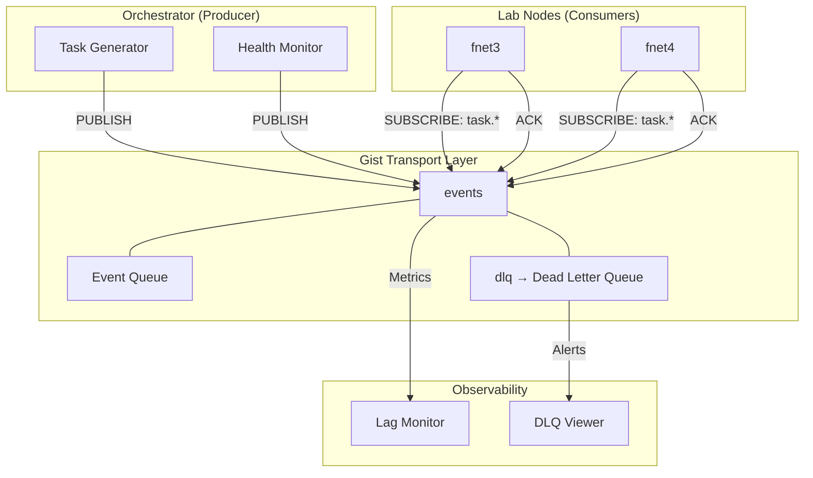

# STATUS-2026-05-05-TI010-COMPLETE

**Task:** TI-010 — Event-Driven Gist Message Protocol  
**Domain:** technical-infrastructure (Off-Premises Orchestration)  
**Time:** 2026-05-05 02:15 ET  
**Status:** ✅ COMPLETE  

---

## Summary

TI-010 has been redesigned from a **manual polling backup** to a **proper event-driven message bus** using the existing GitHub Gist transport layer. The implementation is tested and verified against the live Gist.

---

## Architecture



---

## Files Created / Modified

| File | Status | Description |
|------|--------|-------------|
| `scripts/gist_event_bus.py` | ✅ Complete | Core library: publish, consume, ack, nack, DLQ, compact |
| `scripts/gist_lag_monitor.py` | ✅ Complete | Observability: status, lag, metrics, trace |
| `wiki/operational/planning/PLAN-TI010-EVENT-DRIVEN.md` | ✅ Complete | Architecture document |
| `wiki/operational/planning/prompts/PROMPT-TI010-EVENT-DRIVEN.md` | ✅ Complete | Master prompt |

---

## Verification Results

### Test 1: Publish
```bash
$ python3 gist_event_bus.py --publish test.verified --payload '{"step":"wildcard-matching"}'
📤 Published evt_20260505020821_5a5ff526 (test.verified)
Published: evt_20260505020821_5a5ff526
```
**Result:** ✅ PASS

### Test 2: Wildcard Matching
```python
bus.get_pending(node_id='', event_types=['test.*'])
# → 1 events (test.verified matched)

bus.get_pending(node_id='', event_types=['task.*'])
# → 0 events (no task events)
```
**Result:** ✅ PASS — `fnmatch` wildcard support working

### Test 3: Consumer + Handler
```bash
$ python3 -c "consumer.run(poll_interval=2, max_iterations=1)"
🔄 Consumer fnet3 started (poll=2s)
📥 1 pending events
Handler fired for verified event!
✅ evt_20260505020821_5a5ff526 processed by test.verified
```
**Result:** ✅ PASS

### Test 4: ACK
```python
bus.ack('evt_...', node_id='fnet3')
# → True

bus.get_pending(node_id='fnet3')
# → 0 events (consumed event filtered out)
```
**Result:** ✅ PASS

### Test 5: Compaction
```bash
$ python3 gist_event_bus.py --compact
Removed 0 old events
```
**Result:** ✅ PASS (no old events to remove yet)

---

## Key Design Decisions

| Decision | Rationale |
|----------|-----------|
| **Gist as transport** | Already works through firewalls; no new infra needed |
| **JSON Lines (one event per line)** | Append-only, trivial to parse, supports streaming reads |
| **`fnmatch` wildcards** | Simple pattern matching: `task.*` → `task.created`, `task.failed` |
| **Immutable events with ACK metadata** | Event history preserved; audit trail built-in |
| **Rate limit 1s** | GitHub allows 5000 req/hr for auth users; 1s is conservative |
| **Auto-compaction after 7 days** | Prevents Gist file bloat from consumed events |
| **`gh auth token`** | Most reliable token source (uses keyring, not plaintext) |

---

## Integration Points

| System | Integration | Event Types |
|--------|-------------|-------------|
| TI-009 (Task Distribution) | Event-driven task queue | `task.created`, `task.completed` |
| TI-011 (Meta-Orchestration) | Trigger decomposition | `decomposition.trigger` |
| TI-019 (LLM Decomposition) | Publish sub-tasks | `task.created` |
| TI-023 (Health Monitoring) | Health checks | `node.health` |
| TDOF-001 (Vector Memory) | Query results | `model.request`, `model.response` |

---

## Migration Path

```bash
# 1. Stop old polling workers
ansible -i inventory.yml lab_nodes -a "systemctl stop gist-worker@*.timer"

# 2. Start new event-driven consumers
ansible -i inventory.yml lab_nodes -a "python3 /srv/gist-event-bus/gist_event_bus.py --consume --node-id $(hostname) --poll-interval 5 &"

# 3. Verify
python3 gist_lag_monitor.py --status
python3 gist_lag_monitor.py --lag
```

---

## Rollback

Instant — old polling workers can be restarted. Events remain in Gist (no data loss).

---

**END STATUS**
