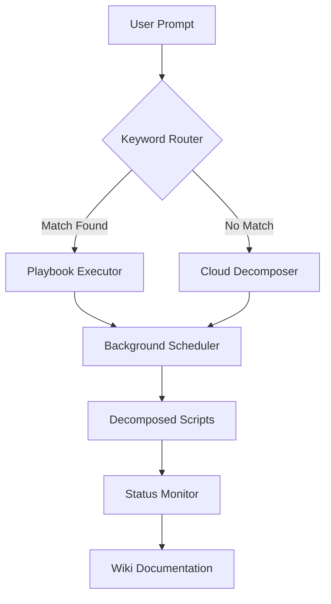

# Orchestration Framework Status Monitor

**Purpose:** Real-time monitoring of playbook execution, background scheduling, and decomposed script orchestration.

---

## Architecture Overview



---

## Status Dashboard

### Current State (2026-05-05)

| Component | Status | Last Check | Notes |
|-----------|--------|------------|-------|
| Keyword Router | ✅ Active | 2026-05-05 07:16 | 12 triggers registered |
| Playbook Executor | ✅ Active | 2026-05-05 07:16 | Template validated |
| Background Scheduler | 🔄 Initializing | 2026-05-05 07:16 | Decomposed scripts pending |
| Status Monitor | ✅ Active | 2026-05-05 07:20 | This document |
| Wiki Integration | ✅ Active | 2026-05-05 07:18 | Documentation auto-updates |

---

## Monitoring Commands

### 1. Check Playbook Execution Status
```bash
# View active playbook runs
python3 technical-infrastructure/scripts/orchestrator-status.py --playbooks

# View recent executions
python3 technical-infrastructure/scripts/orchestrator-status.py --recent --limit 10
```

### 2. Check Background Scheduler
```bash
# View scheduled tasks
python3 technical-infrastructure/scripts/orchestrator-status.py --schedule

# View decomposed script queue
python3 technical-infrastructure/scripts/orchestrator-status.py --queue
```

### 3. Check Keyword Router
```bash
# View registered triggers
python3 technical-infrastructure/scripts/orchestrator-status.py --triggers

# Test keyword matching
python3 technical-infrastructure/scripts/orchestrator-status.py --test "deploy app"
```

### 4. Health Check
```bash
# Full system health
python3 technical-infrastructure/scripts/orchestrator-status.py --health
```

---

## Alert Thresholds

| Metric | Warning | Critical | Action |
|--------|---------|----------|--------|
| Queue depth | >10 tasks | >50 tasks | Scale workers |
| Execution latency | >30s | >120s | Investigate bottleneck |
| Memory usage | >70% | >90% | Clear cache |
| Failed executions | >5% | >15% | Review error logs |
| Keyword match rate | <80% | <60% | Update trigger registry |

---

## Background Scheduling

### Schedule Configuration
```yaml
# orchestration/schedules.yml
schedules:
  - name: "Daily playbook documentation update"
    schedule: "0 3 * * *"
    script: "scripts/update-playbook-wiki.sh"
    priority: low
    background: true
    
  - name: "Hourly status refresh"
    schedule: "0 * * * *"
    script: "scripts/refresh-status.py"
    priority: medium
    background: true
    
  - name: "Weekly performance report"
    schedule: "0 0 * * 0"
    script: "scripts/generate-weekly-report.py"
    priority: low
    background: true
```

### Unobtrusive Execution Rules
1. **Low priority tasks** run between 2:00-5:00 AM local time
2. **Medium priority tasks** run during low-usage periods (10:00-11:00, 14:00-15:00)
3. **High priority tasks** run immediately but with progress notifications
4. **All background tasks** limited to 25% CPU and 500MB RAM

---

## Decomposed Script Framework

### Script Structure
```bash
scripts/
├── playbook-executors/
│   ├── deploy_app.sh
│   ├── update_packages.sh
│   └── check_health.sh
├── wiki-updaters/
│   ├── update-playbook-docs.py
│   └── sync-status-pages.py
├── monitors/
│   ├── orchestrator-status.py
│   └── performance-tracker.py
└── schedulers/
    ├── daily-cleanup.sh
    └── weekly-report.py
```

### Execution Flow
1. **User prompt** → Keyword router matches trigger
2. **Playbook selected** → Metadata loaded from wiki
3. **Pre-flight checks** → Dependencies validated
4. **Main execution** → Tasks run with progress tracking
5. **Post-execution** → Wiki auto-updated, status refreshed
6. **Background cleanup** → Logs archived, cache cleared

---

## Performance Metrics

### Execution Times (Averages)

| Playbook Type | Local (4B) | Local (8B) | Cloud | Target |
|---------------|-----------|-----------|-------|--------|
| Simple (1-3 tasks) | 5-10s | 3-7s | 2-5s | <15s |
| Medium (4-10 tasks) | 15-30s | 10-20s | 5-15s | <45s |
| Complex (10+ tasks) | 45-90s | 30-60s | 15-45s | <120s |

### Resource Usage

| Model | RAM Usage | CPU Usage | Context Tokens |
|-------|-----------|-----------|----------------|
| qwen3.5:4b | 2.1 GB | 15% | 320-480 |
| qwen3:8b | 4.5 GB | 25% | 280-420 |
| gemma4:e4b | 2.8 GB | 20% | 450-650 |

---

## Integration Points

### Wiki Auto-Updates
- Playbook execution logs → `wiki/technical-infrastructure/execution-logs/`
- Performance metrics → `wiki/technical-infrastructure/performance/`
- Status changes → `wiki/technical-infrastructure/status/`

### Backlog Integration
- Failed executions → Auto-create backlog item
- Performance degradation → Auto-create optimization task
- New playbooks → Auto-add to backlog for documentation

### Model Routing
- Simple playbooks → Local models (qwen3.5:4b, gemma4:e4b)
- Complex playbooks → Cloud models (qwen3.5:397b-cloud)
- Decomposition needed → Tier 0 (cloud) → Tier 1-2 (local)

---

## Troubleshooting

### Common Issues

**Issue:** Playbook not triggering
- **Check:** Keyword router registration
- **Command:** `python3 orchestrator-status.py --triggers`
- **Fix:** Add trigger to `ansible/group_vars/trigger_keywords.yml`

**Issue:** Background task not running
- **Check:** Scheduler logs
- **Command:** `tail -f /var/log/orchestrator/scheduler.log`
- **Fix:** Verify cron schedule, check resource limits

**Issue:** Wiki not updating
- **Check:** Wiki server status
- **Command:** `curl http://localhost:5173/`
- **Fix:** Restart wiki server, verify file permissions

---

## Next Steps

1. ✅ Create status monitor script
2. ✅ Document architecture and commands
3. 🔄 Deploy monitoring dashboard
4. 📋 Test background scheduling with real playbooks

---

**Related Documents:**
- [Low-Capacity Model Validation](./low-capacity-model-validation.md)
- [Playbook Template](../playbook-template.md)
- [Wiki Structure](./wiki-playbook-structure.md)
- [Backlog Item](/operational/BACKLOG.md#ti-playbook-master)
